# AI-Powered Guardian

## Logical View (C4 Component Diagram)

### Stage 01: Core RBAC Service

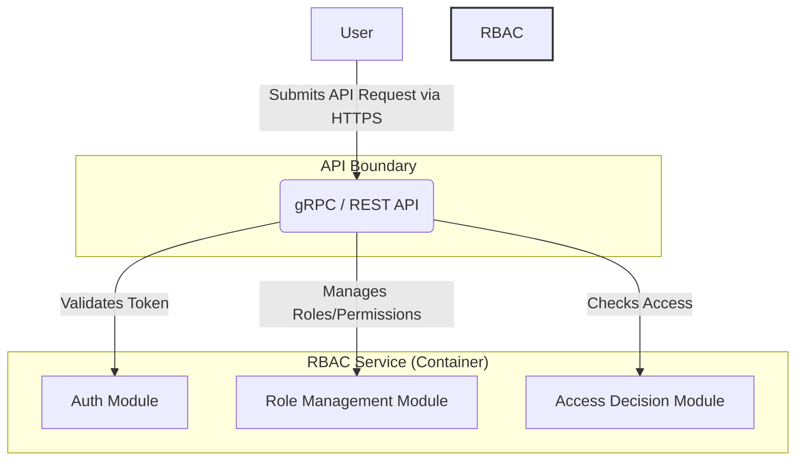
```mermaid
graph TD
    subgraph "RBAC Service (Container)"
        A[Auth Module]
        B[Role Management Module]
        C[Access Decision Module]
    end

    U[User] -->|Submits API Request via HTTPS| API
    
    subgraph "API Boundary"
        API(gRPC / REST API)
    end

    API -->|Validates Token| A
    API -->|Manages Roles/Permissions| B
    API -->|Checks Access| C

    style RBAC Service fill:#f9f,stroke:#333,stroke-width:2px
```

### Stage 02: Data Persistence

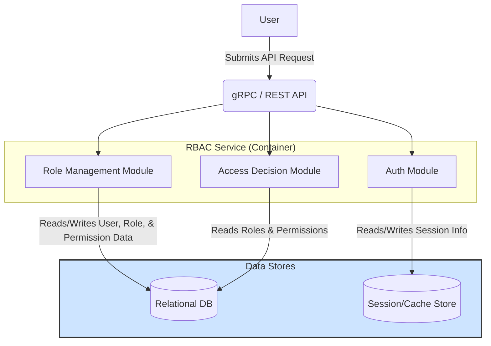
```mermaid
graph TD
    subgraph "RBAC Service (Container)"
        A[Auth Module]
        B[Role Management Module]
        C[Access Decision Module]
    end

    U[User] -->|Submits API Request| API(gRPC / REST API)

    API --> A
    API --> B
    API --> C

    subgraph DataStores ["Data Stores"]
        DB[(Relational DB)]
        Cache[(Session/Cache Store)]
    end

    B -- "Reads/Writes User, Role, & Permission Data" --> DB
    C -- "Reads Roles & Permissions" --> DB
    A -- "Reads/Writes Session Info" --> Cache

    style DataStores fill:#cde4ff,stroke:#333,stroke-width:2px
```

### Stage 03: Web-facing UI & API Gateway

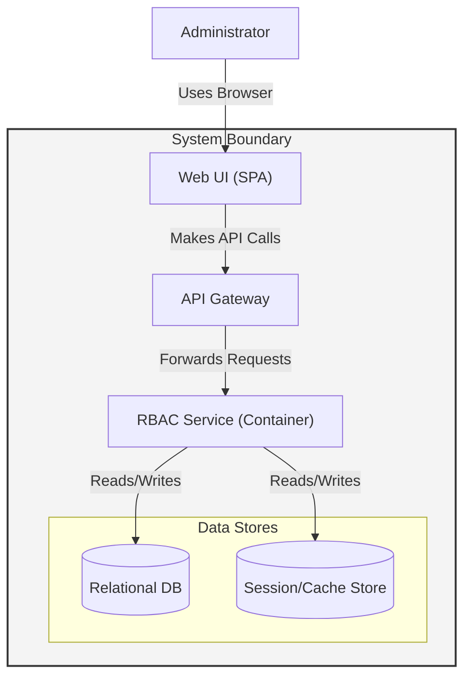
```mermaid
graph TD
    subgraph SystemBoundary ["System Boundary"]
        WebUI["Web UI (SPA)"]
        APIGateway[API Gateway]
        RBAC_Service["RBAC Service (Container)"]
        
        subgraph DataStores ["Data Stores"]
            DB[(Relational DB)]
            Cache[(Session/Cache Store)]
        end
    end

    User[Administrator] -->|Uses Browser| WebUI
    WebUI -->|Makes API Calls| APIGateway
    
    APIGateway -->|Forwards Requests| RBAC_Service

    RBAC_Service -->|Reads/Writes| DB
    RBAC_Service -->|Reads/Writes| Cache

    style SystemBoundary fill:#f4f4f4,stroke:#333,stroke-width:2px
```

### Stage 04: Asynchronous Logging & Auditing

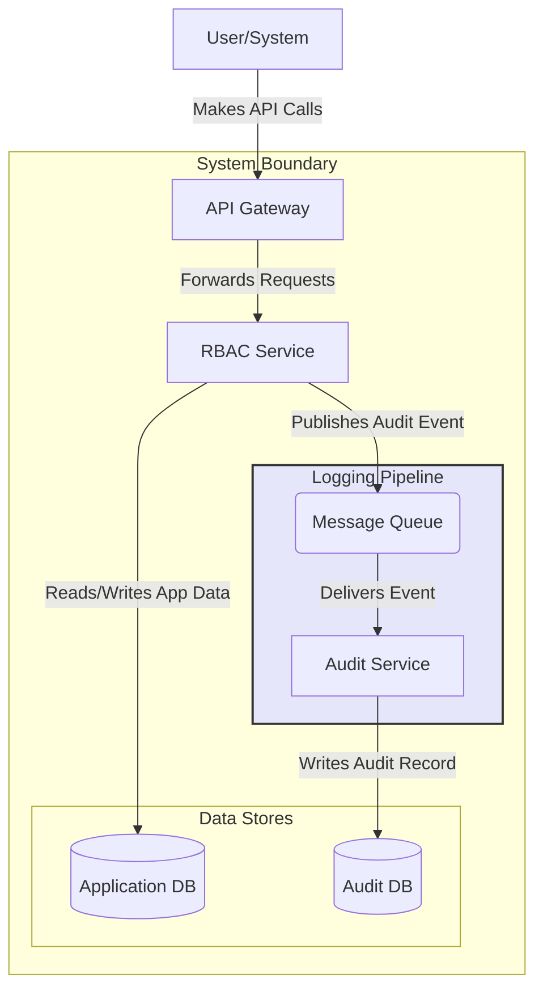
```mermaid
graph TD
    subgraph SystemBoundary ["System Boundary"]
        APIGateway[API Gateway]
        RBAC_Service["RBAC Service"]
        
        subgraph LoggingPipeline ["Logging Pipeline"]
            direction LR
            MQ(Message Queue)
            AuditService[Audit Service]
        end

        subgraph DataStores ["Data Stores"]
            AppDB[(Application DB)]
            AuditDB[(Audit DB)]
        end
    end

    User[User/System] -->|Makes API Calls| APIGateway
    APIGateway -->|Forwards Requests| RBAC_Service

    RBAC_Service -->|Reads/Writes App Data| AppDB
    
    RBAC_Service -- "Publishes Audit Event" --> MQ
    MQ -- "Delivers Event" --> AuditService
    AuditService -- "Writes Audit Record" --> AuditDB

    style LoggingPipeline fill:#E6E6FA,stroke:#333,stroke-width:2px
```

### Stage 05: Integration with HRIS

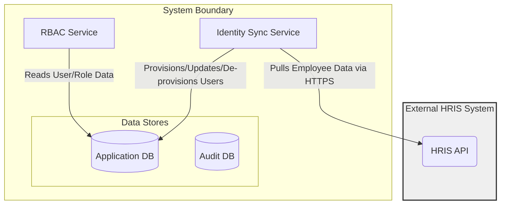
```mermaid
graph TD
    subgraph HRIS_System [External HRIS System]
        HRIS(HRIS API)
    end

    subgraph SystemBoundary ["System Boundary"]
        IdentitySync[Identity Sync Service]
        RBAC_Service[RBAC Service]
        
        subgraph DataStores ["Data Stores"]
            AppDB[(Application DB)]
            AuditDB[(Audit DB)]
        end
    end

    IdentitySync -- "Pulls Employee Data via HTTPS" --> HRIS
    IdentitySync -- "Provisions/Updates/De-provisions Users" --> AppDB
    
    RBAC_Service -- "Reads User/Role Data" --> AppDB
    
    style HRIS_System fill:#EFEFEF,stroke:#333,stroke-width:2px,color:#333
```

### Stage 06: Introducing the AI Anomaly Detection Engine

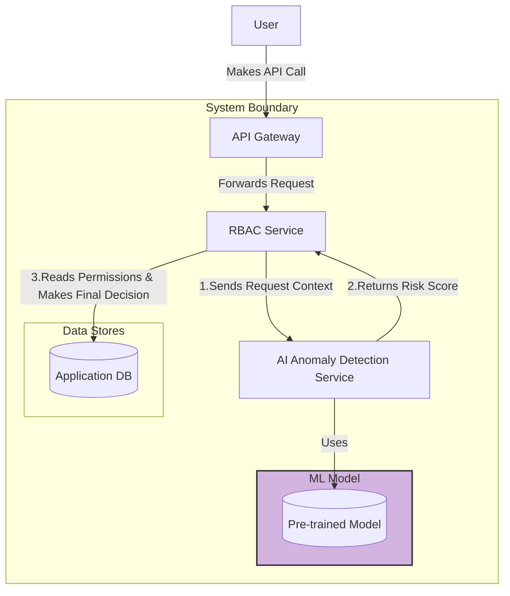
```mermaid
graph TD
    subgraph SystemBoundary ["System Boundary"]
        APIGateway[API Gateway]
        RBAC_Service[RBAC Service]
        AI_Service[AI Anomaly Detection Service]

        subgraph ML_Model [ML Model]
            Model[(Pre-trained Model)]
        end
        
        subgraph DataStores ["Data Stores"]
            AppDB[(Application DB)]
        end
    end

    User[User] -->|Makes API Call| APIGateway
    APIGateway -->|Forwards Request| RBAC_Service

    RBAC_Service -- "1.Sends Request Context" --> AI_Service
    AI_Service -- "Uses" --> Model
    AI_Service -- "2.Returns Risk Score" --> RBAC_Service
    
    RBAC_Service -- "3.Reads Permissions & Makes Final Decision" --> AppDB
    
    style ML_Model fill:#D2B4DE,stroke:#333,stroke-width:2px
```

### Stage 07: Caching for Performance

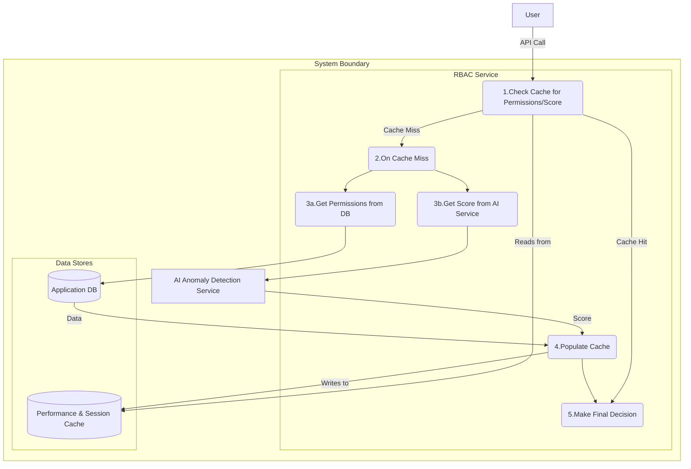
```mermaid
graph TD
    subgraph SystemBoundary ["System Boundary"]
        subgraph RBAC_Service ["RBAC Service"]
            direction LR
            A("1.Check Cache for Permissions/Score")
            B("2.On Cache Miss")
            C("3a.Get Permissions from DB")
            D("3b.Get Score from AI Service")
            E("4.Populate Cache")
            F("5.Make Final Decision")
        end

        AI_Service[AI Anomaly Detection Service]

        subgraph DataStores ["Data Stores"]
            AppDB[(Application DB)]
            Cache[(Performance & Session Cache)]
        end
    end

    User[User] --> |API Call| A

    A -- "Reads from" --> Cache
    A -- "Cache Miss" --> B
    B --> C & D
    C --> AppDB
    D --> AI_Service
    AppDB -- "Data" --> E
    AI_Service -- "Score" --> E
    E -- "Writes to" --> Cache
    A -- "Cache Hit" --> F
    E --> F
```

### Stage 08: High Availability & Scalability (No Change in Logical View)

```mermaid
graph TD
    subgraph SystemBoundary ["System Boundary"]
        subgraph RBAC_Service ["RBAC Service"]
            direction LR
            A("1.Check Cache for Permissions/Score")
            B("2.On Cache Miss")
            C("3a.Get Permissions from DB")
            D("3b.Get Score from AI Service")
            E("4.Populate Cache")
            F("5.Make Final Decision")
        end

        AI_Service[AI Anomaly Detection Service]

        subgraph DataStores ["Data Stores"]
            AppDB[(Application DB)]
            Cache[(Performance & Session Cache)]
        end
    end

    User[User] --> |API Call| A

    A -- "Reads from" --> Cache
    A -- "Cache Miss" --> B
    B --> C & D
    C --> AppDB
    D --> AI_Service
    AppDB -- "Data" --> E
    AI_Service -- "Score" --> E
    E -- "Writes to" --> Cache
    A -- "Cache Hit" --> F
    E --> F
```

### Stage 09: AI Model Training & Governance Pipeline

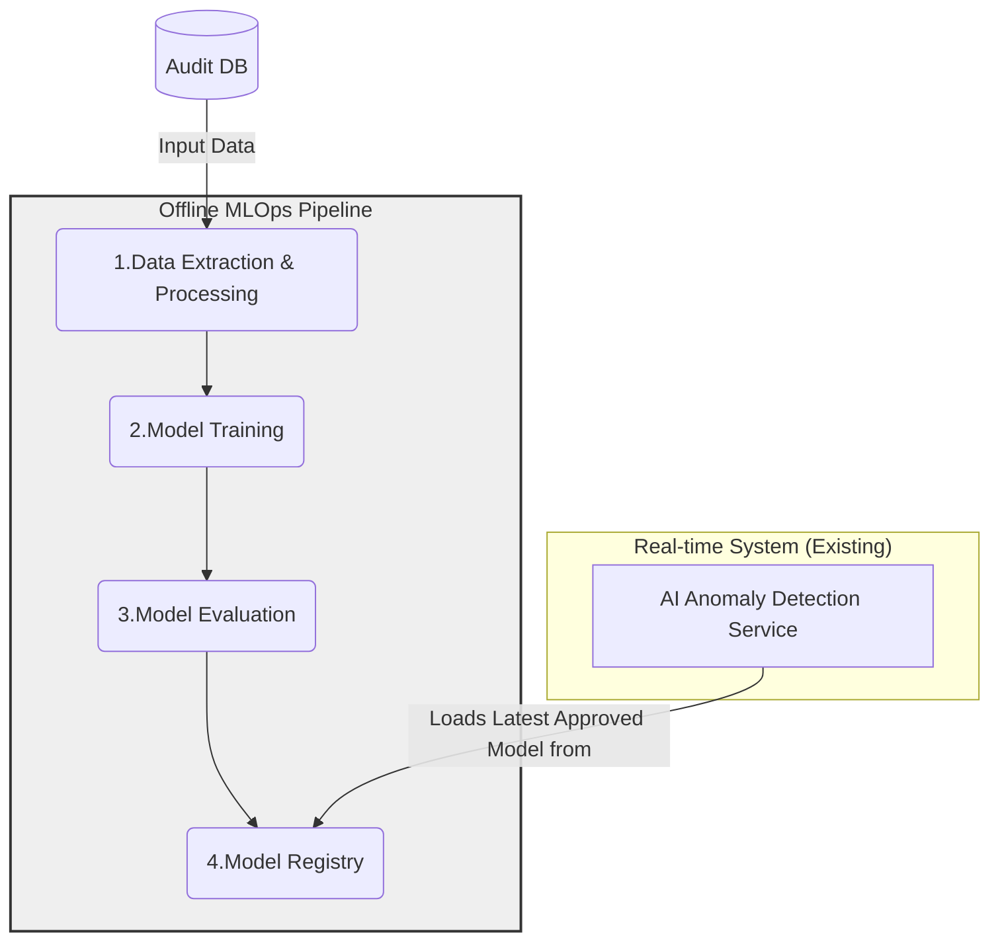
```mermaid
graph TD
    subgraph "Real-time System (Existing)"
        AI_Service[AI Anomaly Detection Service]
    end

    subgraph OfflineMLOpsPipeline ["Offline MLOps Pipeline"]
        direction LR
        Extractor("1.Data Extraction & Processing")
        Trainer("2.Model Training")
        Evaluator("3.Model Evaluation")
        Registry("4.Model Registry")

        Extractor --> Trainer --> Evaluator --> Registry
    end

    AuditDB[(Audit DB)] -- "Input Data" --> Extractor
    
    AI_Service -- "Loads Latest Approved Model from" --> Registry
    
    style OfflineMLOpsPipeline fill:#EFEFEF,stroke:#333,stroke-width:2px,color:#333
```

### Stage 10: SIEM & Monitoring Integration

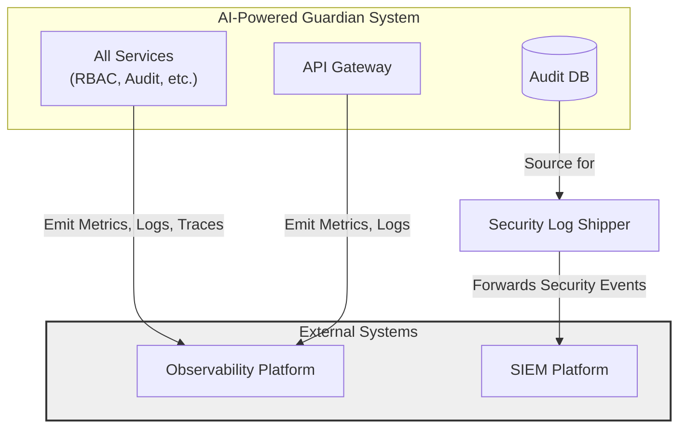
```mermaid
graph TD
    subgraph ExternalSystems ["External Systems"]
        Observability[Observability Platform]
        SIEM[SIEM Platform]
    end

    subgraph SystemBoundary ["AI-Powered Guardian System"]
        direction LR
        APIGateway[API Gateway]
        Services["All Services <br/> (RBAC, Audit, etc.)"]
        AuditDB[(Audit DB)]
    end

    Services -- "Emit Metrics, Logs, Traces" --> Observability
    APIGateway -- "Emit Metrics, Logs" --> Observability
    
    AuditDB -- "Source for" --> LogShipper[Security Log Shipper]
    LogShipper -- "Forwards Security Events" --> SIEM
    
    style ExternalSystems fill:#EFEFEF,stroke:#333,stroke-width:2px,color:#333
```

### Stage 11: Just-in-Time (JIT) Access & Workflow Engine

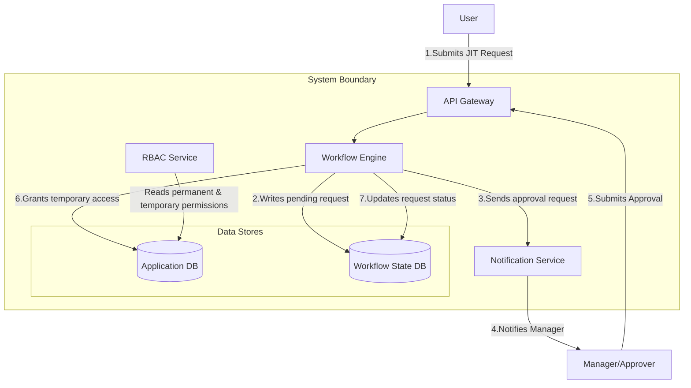
```mermaid
graph TD
    subgraph SystemBoundary ["System Boundary"]
        APIGateway[API Gateway]
        WorkflowEngine[Workflow Engine]
        RBAC_Service[RBAC Service]
        NotificationService[Notification Service]

        subgraph DataStores ["Data Stores"]
            AppDB[(Application DB)]
            WorkflowDB[(Workflow State DB)]
        end
    end

    User[User] -- "1.Submits JIT Request" --> APIGateway
    APIGateway --> WorkflowEngine
    
    WorkflowEngine -- "2.Writes pending request" --> WorkflowDB
    WorkflowEngine -- "3.Sends approval request" --> NotificationService
    NotificationService -- "4.Notifies Manager" --> Approver[Manager/Approver]
    
    Approver -- "5.Submits Approval" --> APIGateway
    
    WorkflowEngine -- "6.Grants temporary access" --> AppDB
    WorkflowEngine -- "7.Updates request status" --> WorkflowDB
    
    RBAC_Service -- "Reads permanent & temporary permissions" --> AppDB
```

### Stage 12: Secrets Management & Security Hardening

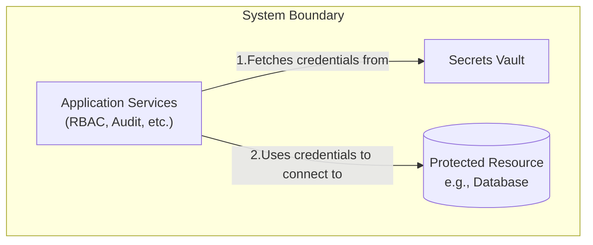
```mermaid
graph TD
    subgraph SystemBoundary ["System Boundary"]
        SecretsVault[Secrets Vault]
        Services["Application Services <br/> (RBAC, Audit, etc.)"]
        ProtectedResource[(Protected Resource <br/> e.g., Database)]
    end

    Services -- "1.Fetches credentials from" --> SecretsVault
    Services -- "2.Uses credentials to connect to" --> ProtectedResource
```

### Overall Logical View (C4 Component Diagram)

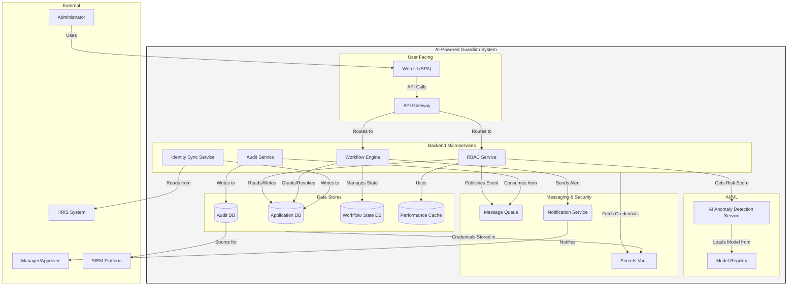
```mermaid
graph TD
    %% --- External Actors & Systems ---
    subgraph "External"
        direction TB
        Admin[Administrator]
        Approver[Manager/Approver]
        HRIS[HRIS System]
        SIEM[SIEM Platform]
    end

    subgraph SystemBoundary ["AI-Powered Guardian System"]
        %% --- User Facing Components ---
        subgraph UserFacing ["User Facing"]
            WebUI["Web UI (SPA)"]
            APIGateway[API Gateway]
        end

        %% --- Backend Services ---
        subgraph BackendServices ["Backend Microservices"]
            RBAC_Service[RBAC Service]
            WorkflowEngine[Workflow Engine]
            IdentitySync[Identity Sync Service]
            AuditService[Audit Service]
        end

        %% --- AI/ML Components ---
        subgraph AI_ML ["AI/ML"]
            AI_Service[AI Anomaly Detection Service]
            ModelRegistry[Model Registry]
        end
        
        %% --- Data Stores ---
        subgraph DataStores ["Data Stores"]
            AppDB[(Application DB)]
            AuditDB[(Audit DB)]
            WorkflowDB[(Workflow State DB)]
            Cache[(Performance Cache)]
        end

        %% --- Messaging & Security ---
        subgraph Messaging ["Messaging & Security"]
            MQ(Message Queue)
            Notifier(Notification Service)
            SecretsVault[Secrets Vault]
        end
    end

    %% --- Logical Flows ---
    Admin -- "Uses" --> WebUI
    WebUI -- "API Calls" --> APIGateway
    APIGateway -- "Routes to" --> RBAC_Service & WorkflowEngine
    
    RBAC_Service -- "Reads/Writes" --> AppDB
    RBAC_Service -- "Uses" --> Cache
    RBAC_Service -- "Gets Risk Score" --> AI_Service
    RBAC_Service -- "Publishes Event" --> MQ
    
    WorkflowEngine -- "Manages State" --> WorkflowDB
    WorkflowEngine -- "Sends Alert" --> Notifier
    WorkflowEngine -- "Grants/Revokes" --> AppDB
    
    IdentitySync -- "Reads from" --> HRIS
    IdentitySync -- "Writes to" --> AppDB
    
    AuditService -- "Consumes from" --> MQ
    AuditService -- "Writes to" --> AuditDB
    
    Notifier -- "Notifies" --> Approver
    
    AI_Service -- "Loads Model from" --> ModelRegistry
    
    AuditDB -- "Source for" --> SIEM
    
    BackendServices -- "Fetch Credentials" --> SecretsVault
    DataStores -- "Credentials Stored in" --> SecretsVault

    style SystemBoundary fill:#f4f4f4,stroke:#333,stroke-width:2px
```

## Physical View (AWS Deployment Diagram)

### Stage 01: Core RBAC Service

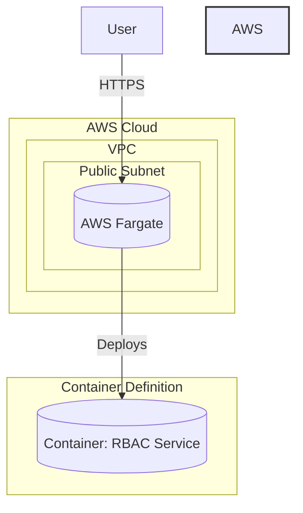
```mermaid
graph TD
    subgraph "AWS Cloud"
        subgraph "VPC"
            subgraph "Public Subnet"
                Fargate[("AWS Fargate")]
            end
        end
    end

    subgraph "Container Definition"
        RBAC_Container[("Container: RBAC Service")]
    end

    Fargate -- Deploys --> RBAC_Container

    User[User] -->|HTTPS| Fargate

    style AWS Cloud fill:#FFDAB9,stroke:#333,stroke-width:2px
```

### Stage 02: Data Persistence

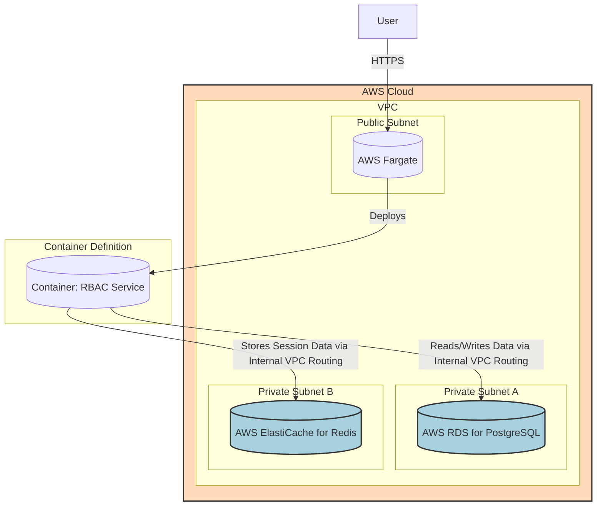
```mermaid
graph TD
    subgraph AWS_Cloud ["AWS Cloud"]
        subgraph VPC ["VPC"]
            subgraph Public_Subnet ["Public Subnet"]
                Fargate[("AWS Fargate")]
            end
            subgraph Private_Subnet_A ["Private Subnet A"]
                RDS[("AWS RDS for PostgreSQL")]
            end
            subgraph Private_Subnet_B ["Private Subnet B"]
                ElastiCache[("AWS ElastiCache for Redis")]
            end
        end
    end

    subgraph Container_Def ["Container Definition"]
        RBAC_Container[("Container: RBAC Service")]
    end

    User[User] -->|HTTPS| Fargate
    Fargate -- Deploys --> RBAC_Container

    RBAC_Container -- "Reads/Writes Data via Internal VPC Routing" --> RDS
    RBAC_Container -- "Stores Session Data via Internal VPC Routing" --> ElastiCache

    style AWS_Cloud fill:#FFDAB9,stroke:#333,stroke-width:2px
    style RDS fill:#A8D1DF,stroke:#333,stroke-width:2px
    style ElastiCache fill:#A8D1DF,stroke:#333,stroke-width:2px
```

### Stage 03: Web-facing UI & API Gateway

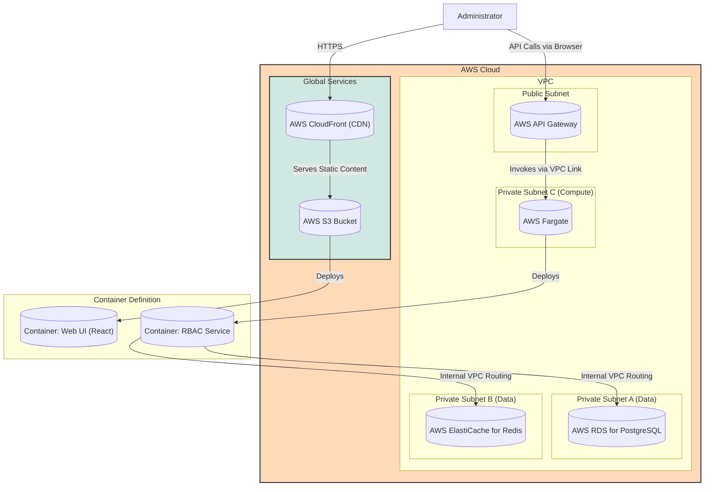
```mermaid
graph TD
    subgraph AWS_Cloud ["AWS Cloud"]
        subgraph Global_Services ["Global Services"]
            CloudFront[("AWS CloudFront (CDN)")]
            S3[("AWS S3 Bucket")]
        end

        subgraph VPC ["VPC"]
            subgraph Public_Subnet ["Public Subnet"]
                APIGW[("AWS API Gateway")]
            end
            
            subgraph Private_Subnet_C ["Private Subnet C (Compute)"]
                 Fargate[("AWS Fargate")]
            end

            subgraph Private_Subnet_A ["Private Subnet A (Data)"]
                RDS[("AWS RDS for PostgreSQL")]
            end

            subgraph Private_Subnet_B ["Private Subnet B (Data)"]
                ElastiCache[("AWS ElastiCache for Redis")]
            end
        end
    end
    
    subgraph Container_Def ["Container Definition"]
        WebUI_Container[("Container: Web UI (React)")]
        RBAC_Container[("Container: RBAC Service")]
    end

    User[Administrator] -->|HTTPS| CloudFront
    CloudFront -->|Serves Static Content| S3
    User -->|API Calls via Browser| APIGW
    
    S3 -- Deploys --> WebUI_Container

    APIGW -->|Invokes via VPC Link| Fargate
    
    Fargate -- Deploys --> RBAC_Container

    RBAC_Container -->|Internal VPC Routing| RDS
    RBAC_Container -->|Internal VPC Routing| ElastiCache

    style AWS_Cloud fill:#FFDAB9,stroke:#333,stroke-width:2px
    style Global_Services fill:#D1E8E2,stroke:#333,stroke-width:2px
```

### Stage 04: Asynchronous Logging & Auditing

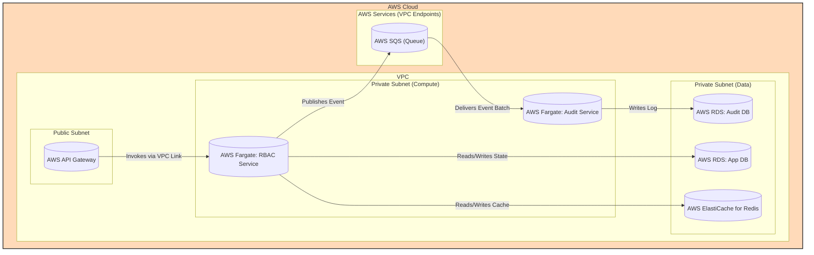
```mermaid
graph TD
    subgraph AWS_Cloud ["AWS Cloud"]
        subgraph VPC ["VPC"]
            subgraph Public_Subnet ["Public Subnet"]
                APIGW[("AWS API Gateway")]
            end
            
            subgraph Private_Subnet_Compute ["Private Subnet (Compute)"]
                 RBAC_Fargate[("AWS Fargate: RBAC Service")]
                 Audit_Fargate[("AWS Fargate: Audit Service")]
            end

            subgraph Private_Subnet_Data ["Private Subnet (Data)"]
                App_RDS[("AWS RDS: App DB")]
                Audit_RDS[("AWS RDS: Audit DB")]
                ElastiCache[("AWS ElastiCache for Redis")]
            end
        end
        
        subgraph AWS_Services ["AWS Services (VPC Endpoints)"]
            SQS[("AWS SQS (Queue)")]
        end
    end

    APIGW -->|Invokes via VPC Link| RBAC_Fargate
    
    RBAC_Fargate -- "Publishes Event" --> SQS
    SQS -- "Delivers Event Batch" --> Audit_Fargate

    Audit_Fargate -- "Writes Log" --> Audit_RDS
    RBAC_Fargate -- "Reads/Writes State" --> App_RDS
    RBAC_Fargate -- "Reads/Writes Cache" --> ElastiCache
    
    style AWS_Cloud fill:#FFDAB9,stroke:#333,stroke-width:2px
```

### Stage 05: Integration with HRIS

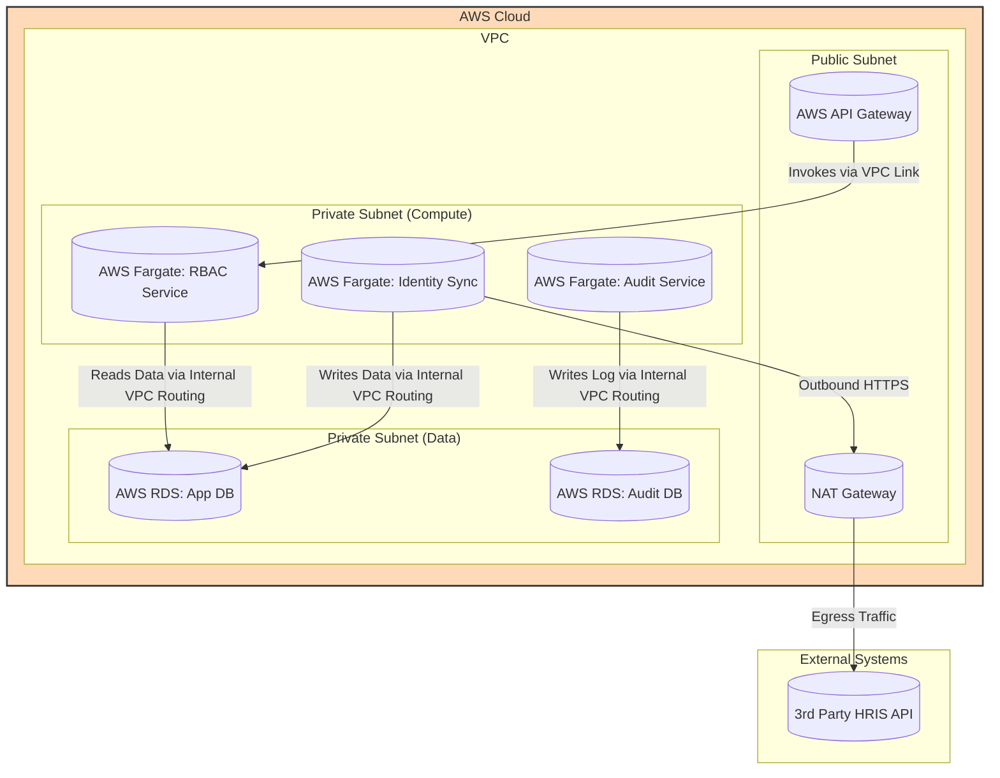
```mermaid
graph TD
    subgraph ExternalSystems ["External Systems"]
        HRIS[("3rd Party HRIS API")]
    end

    subgraph AWS_Cloud ["AWS Cloud"]
        subgraph VPC ["VPC"]
            subgraph Public_Subnet ["Public Subnet"]
                APIGW[("AWS API Gateway")]
                NAT[("NAT Gateway")]
            end
            
            subgraph Private_Subnet_Compute ["Private Subnet (Compute)"]
                 RBAC_Fargate[("AWS Fargate: RBAC Service")]
                 Audit_Fargate[("AWS Fargate: Audit Service")]
                 IdentitySync_Fargate[("AWS Fargate: Identity Sync")]
            end

            subgraph Private_Subnet_Data ["Private Subnet (Data)"]
                App_RDS[("AWS RDS: App DB")]
                Audit_RDS[("AWS RDS: Audit DB")]
            end
        end
    end

    APIGW -- "Invokes via VPC Link" --> RBAC_Fargate

    IdentitySync_Fargate -- "Outbound HTTPS" --> NAT
    NAT -->|Egress Traffic| HRIS

    IdentitySync_Fargate -- "Writes Data via Internal VPC Routing" --> App_RDS
    RBAC_Fargate -- "Reads Data via Internal VPC Routing" --> App_RDS
    Audit_Fargate -- "Writes Log via Internal VPC Routing" --> Audit_RDS
    
    style AWS_Cloud fill:#FFDAB9,stroke:#333,stroke-width:2px
```

### Stage 06: Introducing the AI Anomaly Detection Engine

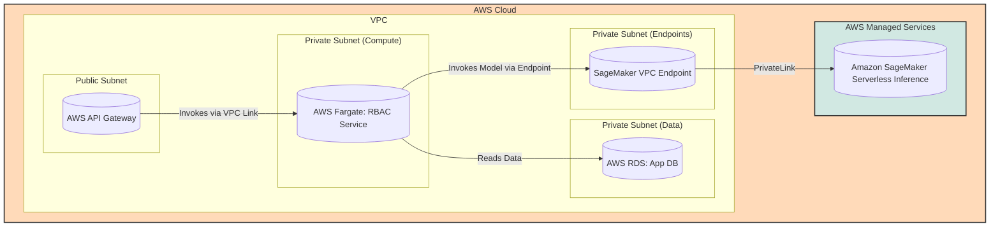
```mermaid
graph TD
    subgraph AWS_Cloud ["AWS Cloud"]
        subgraph VPC ["VPC"]
            subgraph Public_Subnet ["Public Subnet"]
                APIGW[("AWS API Gateway")]
            end
            
            subgraph Private_Subnet_Compute ["Private Subnet (Compute)"]
                 RBAC_Fargate[("AWS Fargate: RBAC Service")]
            end

            subgraph Private_Subnet_Data ["Private Subnet (Data)"]
                App_RDS[("AWS RDS: App DB")]
            end
            
            subgraph Private_Subnet_Endpoints ["Private Subnet (Endpoints)"]
                SageMakerEndpoint[("SageMaker VPC Endpoint")]
            end
        end
        
        subgraph AWS_Managed_Services ["AWS Managed Services"]
             SageMaker[("Amazon SageMaker Serverless Inference")]
        end
    end

    APIGW -- "Invokes via VPC Link" --> RBAC_Fargate
    
    RBAC_Fargate -- "Invokes Model via Endpoint" --> SageMakerEndpoint
    SageMakerEndpoint -- "PrivateLink" --> SageMaker
    
    RBAC_Fargate -- "Reads Data" --> App_RDS
    
    style AWS_Cloud fill:#FFDAB9,stroke:#333,stroke-width:2px
    style AWS_Managed_Services fill:#D1E8E2,stroke:#333,stroke-width:2px
```

### Stage 07: Caching for Performance

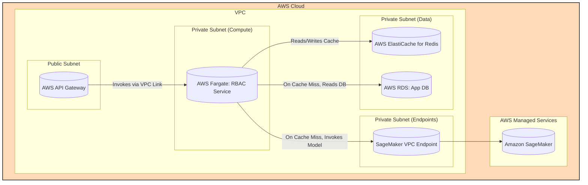
```mermaid
graph TD
    subgraph AWS_Cloud ["AWS Cloud"]
        subgraph VPC ["VPC"]
            subgraph Public_Subnet ["Public Subnet"]
                APIGW[("AWS API Gateway")]
            end
            
            subgraph Private_Subnet_Compute ["Private Subnet (Compute)"]
                 RBAC_Fargate[("AWS Fargate: RBAC Service")]
            end

            subgraph Private_Subnet_Data ["Private Subnet (Data)"]
                App_RDS[("AWS RDS: App DB")]
                Redis[("AWS ElastiCache for Redis")]
            end
            
            subgraph Private_Subnet_Endpoints ["Private Subnet (Endpoints)"]
                SageMakerEndpoint[("SageMaker VPC Endpoint")]
            end
        end
        
        subgraph AWS_Managed_Services ["AWS Managed Services"]
             SageMaker[("Amazon SageMaker")]
        end
    end

    APIGW -- "Invokes via VPC Link" --> RBAC_Fargate
    
    RBAC_Fargate -- "Reads/Writes Cache" --> Redis
    RBAC_Fargate -- "On Cache Miss, Reads DB" --> App_RDS
    RBAC_Fargate -- "On Cache Miss, Invokes Model" --> SageMakerEndpoint
    SageMakerEndpoint --> SageMaker
    
    style AWS_Cloud fill:#FFDAB9,stroke:#333,stroke-width:2px
```

### Stage 08: High Availability & Scalability

```mermaid
graph TD
    subgraph AWS_Cloud ["AWS Cloud"]
        APIGW[("AWS API Gateway")]

        subgraph VPC ["VPC"]
            subgraph Public_Subnets ["Public Subnets (Multi-AZ)"]
                ALB[("Application Load Balancer")]
            end

            subgraph Private_Subnets_Compute ["Private Subnets (Compute, Multi-AZ)"]
                FargateServices[("Fargate Services (Auto Scaled)")]
            end

            subgraph Private_Subnets_Data ["Private Subnets (Data, Multi-AZ)"]
                subgraph RDS_HA ["RDS Multi-AZ"]
                    RDS_Primary[("RDS Primary")] -- Synchronous Replication --> RDS_Standby[("RDS Standby")]
                end
                ElastiCache_HA[("ElastiCache Multi-AZ")]
            end
        end
    end

    APIGW --> ALB
    ALB --> FargateServices
    
    FargateServices -- "Reads/Writes" --> RDS_Primary
    FargateServices -- "Reads/Writes" --> ElastiCache_HA
    FargateServices -- "Publishes Events" --> SQS[("AWS SQS")]
    SQS --> FargateServices
```

### Stage 09: AI Model Training & Governance Pipeline

```mermaid
graph TD
    subgraph MLOps_Pipeline ["MLOps Pipeline (Serverless & Event-Driven)"]
        EventBridge[("EventBridge (Scheduler)")]
        StepFunctions[("AWS Step Functions")]
        Glue[("AWS Glue (ETL Job)")]
        SageMakerTrain[("SageMaker Training Job")]
        SageMakerRegistry[("SageMaker Model Registry")]
        
        subgraph DataLake ["S3 Data Lake"]
            RawData[("S3: Raw Data")]
            ProcessedData[("S3: Processed Data")]
        end
    end

    subgraph App_VPC ["Application VPC (Existing)"]
         Audit_RDS[("AWS RDS: Audit DB")]
    end
    
    subgraph Real_time_Inference ["Real-time Inference (Existing)"]
        SageMakerEndpoint[("SageMaker Inference Endpoint")]
    end

    EventBridge -- "Triggers" --> StepFunctions
    StepFunctions -- "Step 1: Start ETL" --> Glue
    StepFunctions -- "Step 2: Start Training" --> SageMakerTrain
    
    Glue -- "Reads from" --> Audit_RDS
    Glue -- "Writes to" --> RawData & ProcessedData
    
    SageMakerTrain -- "Reads Training Data from" --> ProcessedData
    SageMakerTrain -- "Outputs Trained Model to" --> SageMakerRegistry
    
    SageMakerRegistry -- "Updates Model Version for" --> SageMakerEndpoint
    
    style MLOps_Pipeline fill:#D1E8E2,stroke:#333,stroke-width:2px
```

### Stage 10: SIEM & Monitoring Integration

```mermaid
graph TD
    subgraph Bank_Infrastructure ["Bank Infrastructure (External)"]
        SIEM_Endpoint[("SIEM HTTP Event Collector")]
    end

    subgraph AWS_Cloud ["AWS Cloud"]
        subgraph App_VPC ["Application VPC (Existing)"]
            FargateServices[("Fargate Services")]
            Audit_RDS[("AWS RDS: Audit DB")]
        end
        
        subgraph Observability_Plane ["Observability Plane (AWS)"]
            CloudWatch[("Amazon CloudWatch <br/> (Metrics, Logs, Dashboards)")]
        end
        
        subgraph SIEM_Integration_Pipeline ["SIEM Integration Pipeline"]
            direction LR
            CDC_Stream[("RDS CDC Stream <br/> or Lambda Trigger")]
            Firehose[("Kinesis Data Firehose")]
            
            CDC_Stream --> Firehose
        end
    end
    
    FargateServices -- "Sends Metrics & Logs" --> CloudWatch
    
    Audit_RDS -- "Triggers" --> CDC_Stream
    Firehose -- "Delivers Formatted Events" --> SIEM_Endpoint
    
    style Bank_Infrastructure fill:#EFEFEF,stroke:#333,stroke-width:2px,color:#333
    style SIEM_Integration_Pipeline fill:#D1E8E2,stroke:#333,stroke-width:2px
```

### Stage 11: Just-in-Time (JIT) Access & Workflow Engine

```mermaid
graph TD
    subgraph AWS_Cloud ["AWS Cloud"]
        subgraph App_VPC ["Application VPC (Existing)"]
            subgraph Private_Compute ["Private Subnets (Compute)"]
                Workflow_Fargate[("Fargate: Workflow Engine")]
                RBAC_Fargate[("Fargate: RBAC Service")]
            end
            subgraph Private_Data ["Private Subnets (Data)"]
                App_RDS[("AWS RDS: App DB")]
            end
        end

        subgraph AWS_Managed_Services ["AWS Managed Services"]
            DynamoDB[("Amazon DynamoDB")]
            SNS[("Amazon SNS")]
        end
    end
    
    %% --- User Interaction ---
    User[User/Approver] --> APIGW[("API Gateway")]
    APIGW --> Workflow_Fargate

    %% --- Workflow Logic ---
    Workflow_Fargate -- "Reads/Writes State" --> DynamoDB
    Workflow_Fargate -- "Publishes Notification" --> SNS
    SNS -- "Sends Email/SMS" --> Approver
    
    Workflow_Fargate -- "Grants/Revokes Permissions" --> App_RDS
    RBAC_Fargate -- "Reads Permissions" --> App_RDS

    %% --- Auto-Revocation ---
    subgraph Auto_Revocation ["Auto-Revocation (Event-Driven)"]
         DynamoDB_TTL[("DynamoDB TTL Deletes Expired Request")] --> DynamoDB_Stream[("DynamoDB Stream Event")]
         DynamoDB_Stream --> Revoker_Lambda[("Revoker Lambda")]
         Revoker_Lambda --> Workflow_Fargate
    end

    style Auto_Revocation fill:#EFEFEF,stroke:#333,stroke-width:2px,color:#333
```

### Stage 12: Secrets Management & Security Hardening

```mermaid
graph TD
    subgraph AWS_Cloud ["AWS Cloud"]
        subgraph VPC ["VPC"]
            subgraph Private_Compute ["Private Subnets (Compute)"]
                 Fargate_Service[("Fargate Service <br/> (e.g., RBAC Service)")]
            end

            subgraph Private_Data ["Private Subnets (Data)"]
                App_RDS[("AWS RDS: App DB")]
            end
            
            subgraph Private_Endpoints ["Private Subnets (Endpoints)"]
                SecretsManager_Endpoint[("Secrets Manager VPC Endpoint")]
            end
        end
        
        subgraph AWS_Managed_Services ["AWS Managed Services"]
             SecretsManager[("AWS Secrets Manager")]
        end
    end

    subgraph IAM_Role ["IAM Task Role"]
    end
    
    Fargate_Service -- "Assumes" --> IAM_Role
    
    IAM_Role -- "Grants permission for" --> Fargate_Service
    
    Fargate_Service -- "1.Calls 'GetSecretValue' via Endpoint" --> SecretsManager_Endpoint
    SecretsManager_Endpoint -- "PrivateLink" --> SecretsManager
    
    SecretsManager -- "2.Returns DB Credentials" --> Fargate_Service
    
    Fargate_Service -- "3.Connects to DB using fetched credentials" --> App_RDS
    
    style AWS_Cloud fill:#FFDAB9,stroke:#333,stroke-width:2px
```

### Overall Physical View (AWS Deployment Diagram)

```mermaid
graph TD
    subgraph "External Users & Systems"
        User[Administrator / Approver]
        HRIS_API[("3rd Party HRIS API")]
        SIEM_Endpoint[("Bank SIEM Collector")]
    end

    subgraph AWS_Cloud ["AWS Cloud"]
        %% --- Global & Regional Services ---
        CloudFront[("CloudFront (CDN)")] --> S3[("S3 Bucket: Web UI")]
        EventBridge[("EventBridge Scheduler")] --> MLOps_Pipeline
        Observability[("CloudWatch Observability")]
        
        %% --- Main Application VPC ---
        subgraph VPC ["VPC (Multi-AZ)"]
            subgraph Public_Subnets ["Public Subnets"]
                ALB[("Application Load Balancer")]
                NAT[("NAT Gateway")]
            end
            subgraph Private_Compute ["Private Subnets (Compute)"]
                FargateServices[("Fargate Services (Auto Scaled)<br/>RBAC, Audit, Workflow, Identity Sync")]
            end
            subgraph Private_Data ["Private Subnets (Data)"]
                RDS_HA[("RDS Multi-AZ<br/>App & Audit DBs")]
                ElastiCache_HA[("ElastiCache Multi-AZ<br/>Redis Cache")]
            end
            subgraph Private_Endpoints ["Private Subnets (Endpoints)"]
                SecretsManager_Endpoint[("Secrets Manager Endpoint")]
                SageMaker_Endpoint[("SageMaker Endpoint")]
            end
        end

        %% --- AWS Managed Services (Accessed via PrivateLink/IAM) ---
        subgraph AWS_Managed ["AWS Managed Services"]
            SecretsManager[("Secrets Manager")]
            SageMaker[("SageMaker Inference")]
            DynamoDB[("DynamoDB: Workflow State")]
            SQS[("SQS: Audit Queue")]
            SNS[("SNS: Notifications")]
        end

        %% --- Offline MLOps & Data Pipelines ---
        subgraph MLOps_Pipeline ["MLOps & Data Pipelines"]
            StepFunctions[("Step Functions")] --> Glue[("Glue ETL")] & SageMakerTrain[("SageMaker Training")]
            Glue --> S3_DataLake[("S3 Data Lake")]
            SageMakerTrain --> S3_DataLake
            SageMakerTrain --> SageMakerRegistry[("SageMaker Model Registry")]
            Kinesis[("Kinesis Data Firehose")]
        end
    end

    %% --- Primary Connections ---
    User -- "HTTPS" --> CloudFront & APIGW[("API Gateway")]
    APIGW --> ALB
    ALB --> FargateServices
    
    FargateServices -- "IAM + Endpoint" --> SecretsManager
    FargateServices -- "IAM + Endpoint" --> SageMaker
    FargateServices -- "IAM" --> SQS & SNS & DynamoDB
    FargateServices -- "Credentials via Secrets Mgr" --> RDS_HA & ElastiCache_HA
    FargateServices -- "Metrics & Logs" --> Observability
    
    NAT -- "Egress" --> HRIS_API
    
    %% --- Offline Pipeline Connections ---
    Glue -- "Reads via VPC Connector" --> RDS_HA
    SageMakerRegistry -- "Updates Model" --> SageMaker
    RDS_HA -- "CDC Stream" --> Kinesis
    Kinesis -- "Delivers to" --> SIEM_Endpoint

    style AWS_Cloud fill:#FFDAB9,stroke:#333,stroke-width:2px
```
