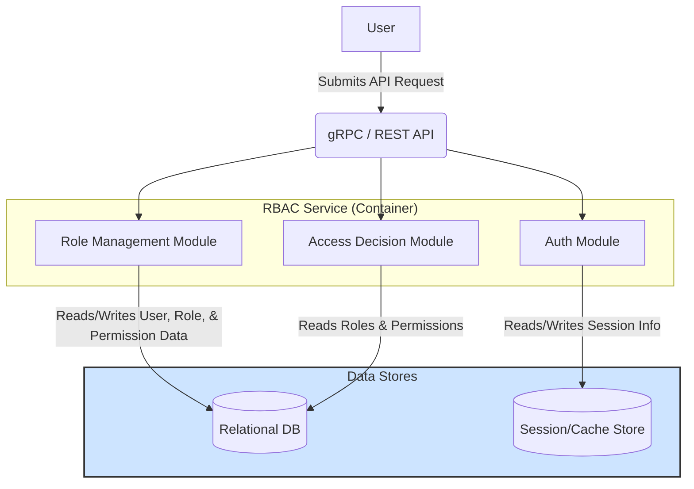
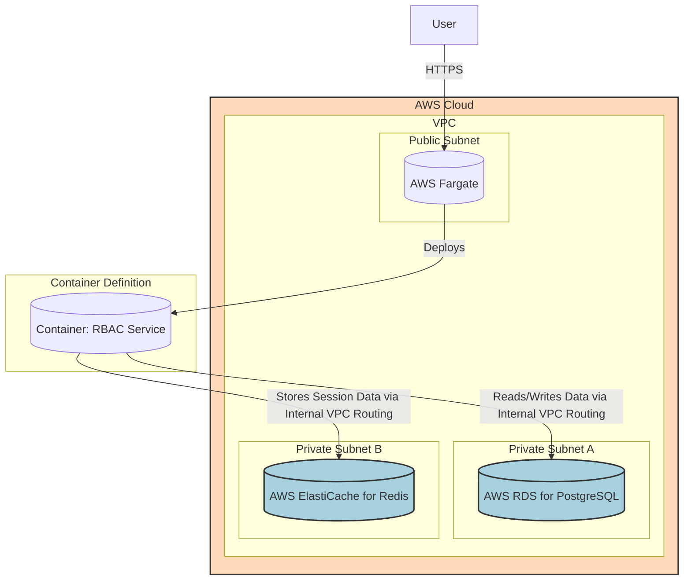

#### Data Persistence

*   **Problem:** The RBAC Service is stateless. It needs a reliable way to store and retrieve user identities, roles, permissions, and asset information.
*   **Solution:** Introduce two managed databases: a PostgreSQL database for structured, relational data (users, roles, permissions) and a Redis database for storing temporary session data and eventually for caching.
*   **Trade-offs:** Using managed AWS services (RDS for PostgreSQL and ElastiCache for Redis) increases operational ease and provides high availability out-of-the-box but introduces vendor lock-in and is more costly than self-hosting. This is a favorable trade-off for focusing on core application logic.

#### 1. Logical View (C4 Component Diagram)

This diagram evolves the previous design, showing the RBAC Service now depending on two new data store components.

#### 2. Physical View (AWS Deployment Diagram)

This physical view introduces **Private Subnets** for our databases—a critical security best practice. The RBAC Service remains in the Public Subnet for now, but its connectivity to the private resources is shown.

#### 3. Component-to-Resource Mapping Table

The table is updated to include our new data store components.

| Logical Component | Physical Resource | Rationale for Choice |
| :--- | :--- | :--- |
| **RBAC Service** | **AWS Fargate Task** | **Simplicity & Serverless:** Fargate abstracts away server management, allowing focus on the application. |
| **Relational DB** | **AWS RDS for PostgreSQL** | **Managed & Reliable:** RDS handles patching, backups, and failover. PostgreSQL is a powerful, open-source relational database well-suited for storing structured user, role, and permission data. |
| **Session/Cache Store** | **AWS ElastiCache for Redis** | **Managed & High-Performance:** ElastiCache provides a managed, in-memory data store. Redis is ideal for the high-speed reads/writes required for session management and will be essential for performance caching later. |
