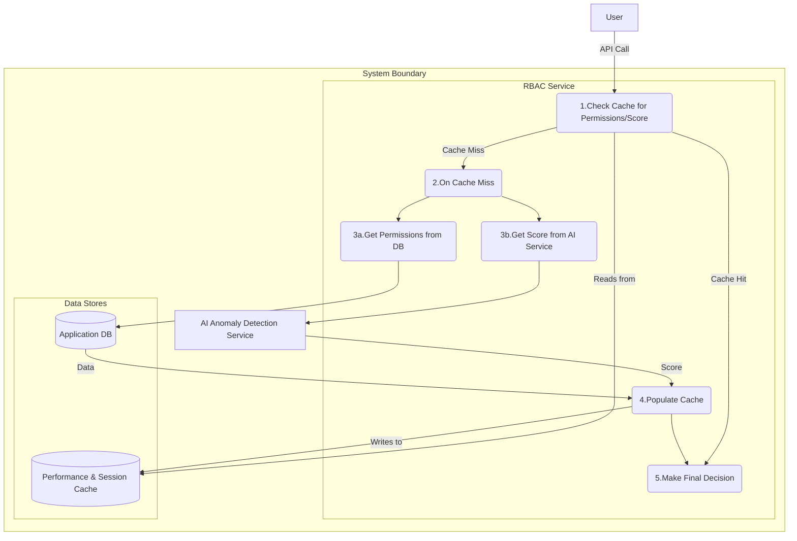
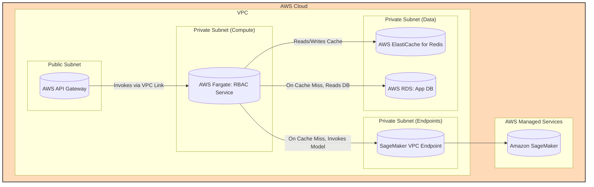

#### Caching for Performance

*   **Problem:** The real-time access decision path now involves multiple network calls (to the AI service and the database). As system load increases, this could lead to unacceptable latency, violating our performance NFRs.
*   **Solution:** Implement a caching strategy using our existing Redis component. The RBAC Service will cache two key pieces of data for a short Time-to-Live (TTL):
    1.  **Resolved Permissions:** The final set of permissions for a user, to avoid repeated database joins.
    2.  **AI Risk Scores:** The risk score for a specific user/asset combination, to avoid re-calculating it on every single request.
*   **Trade-offs:** This introduces eventual consistency. A change in a user's permissions might not be reflected until the cache expires (a delay of a few seconds to minutes). This is a standard and generally acceptable trade-off for the significant performance gain. The logic within the RBAC service becomes more complex as it must now manage cache-miss and cache-hit scenarios.

#### 1. Logical View (C4 Component Diagram)

This view explicitly shows the new caching logic within the `RBAC Service`'s workflow.

#### 2. Physical View (AWS Deployment Diagram)

This view re-introduces the `AWS ElastiCache for Redis` cluster from our earlier `data-persistence` step and shows the `RBAC Service` now actively communicating with it as part of the real-time flow.

#### 3. Component-to-Resource Mapping Table

| Logical Component | Physical Resource | Rationale for Choice |
| :--- | :--- | :--- |
| **RBAC Service** | **AWS Fargate Task** | No change in rationale. |
| **AI Anomaly Detection Service**| **Amazon SageMaker** | No change in rationale. |
| **Performance & Session Cache**| **AWS ElastiCache for Redis** | **High-Speed & In-Memory:** Redis is an in-memory key-value store, providing microsecond latency for reads and writes, making it the perfect choice for a performance-critical cache. ElastiCache manages the deployment, scaling, and patching of the Redis cluster. |
| **Application DB** | **AWS RDS for PostgreSQL** | No change in rationale. |
