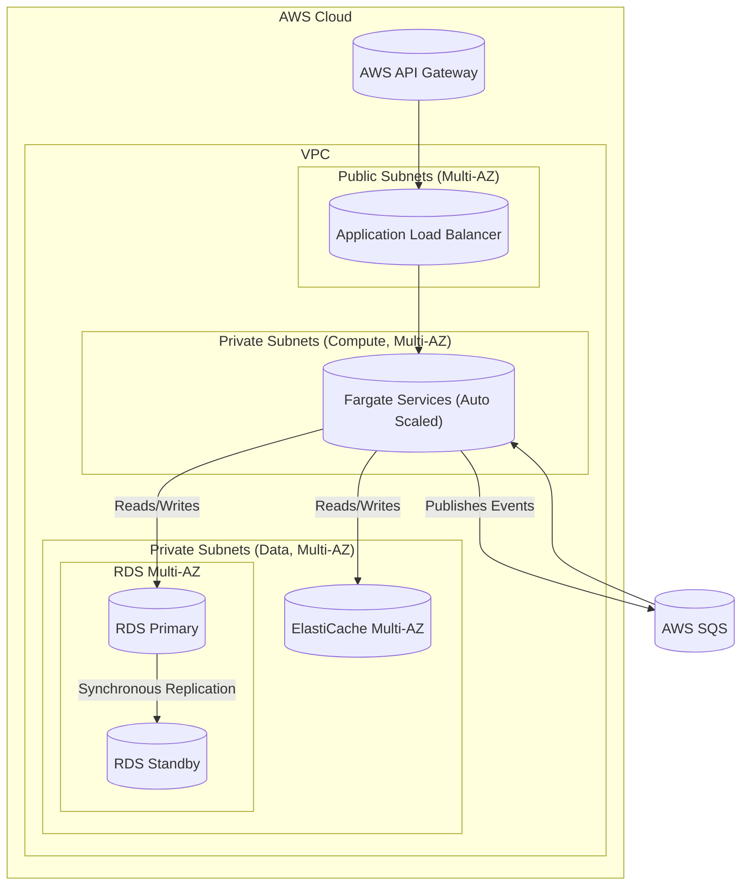

#### High Availability & Scalability

*   **Problem:** The current design has single points of failure. Each service runs as a single container, and the databases are deployed in a single Availability Zone (AZ). The system cannot survive an AZ-level failure and cannot scale horizontally to handle increased user load.
*   **Solution:** Re-architect the physical deployment for High Availability (HA) and scalability.
    1.  Deploy all containerized services (RBAC, Audit, Identity Sync) across **multiple Availability Zones**.
    2.  Introduce an internal **Application Load Balancer (ALB)** to distribute traffic across the service instances. The API Gateway will now route traffic to the ALB.
    3.  Configure **Auto Scaling** for each Fargate service to automatically add or remove container instances based on demand (e.g., CPU or memory utilization).
    4.  Upgrade the RDS and ElastiCache instances to **Multi-AZ configurations** to ensure database resilience.
*   **Trade-offs:** This architecture is significantly more complex to manage and incurs higher costs due to redundant infrastructure. However, it is an essential and non-negotiable step to meet the `99.95%` uptime and scalability requirements outlined in the Project Requirement Document.

#### 1. Logical View (C4 Component Diagram)

**No Change.**

The logical architecture of the system remains the same. We are not adding new logical components or changing their responsibilities. This issue is purely concerned with the physical deployment and resilience of the existing components. Therefore, the last validated logical diagram is still current.

#### 2. Physical View (AWS Deployment Diagram)

This is where the architecture evolves significantly. We will now explicitly show multiple Availability Zones and the new components required for load balancing and scaling.

#### 3. Component-to-Resource Mapping Table

| Logical Component | Physical Resource | Rationale for Choice |
| :--- | :--- | :--- |
| **API Gateway** | **AWS API Gateway** | No change in rationale. |
| *(New Resource)*| **Application Load Balancer (ALB)** | **Traffic Distribution & Health Checks:** The ALB is essential for distributing incoming API traffic across multiple instances of the RBAC service in different AZs. It also performs health checks and will automatically stop sending traffic to unhealthy instances. |
| **RBAC / Audit / etc. Services** | **AWS Fargate with Auto Scaling** | **Scalability & Resilience:** Deploying each service as a Fargate service with an Auto Scaling Group allows the system to automatically scale the number of container instances based on real-time metrics (CPU/Memory). Running instances in multiple AZs provides resilience against a single data center failure. |
| **Application & Audit DB** | **AWS RDS for PostgreSQL (Multi-AZ)** | **Database High Availability:** The Multi-AZ deployment automatically provisions and maintains a synchronous standby replica in a different AZ. In case of a primary DB failure, RDS automatically fails over to the standby with no data loss (RPO of zero). |
| **Cache Store** | **AWS ElastiCache for Redis (Multi-AZ)** | **Cache High Availability:** Similar to RDS, this configuration creates a resilient Redis cluster across multiple AZs, ensuring that the high-performance cache is not a single point of failure. |
