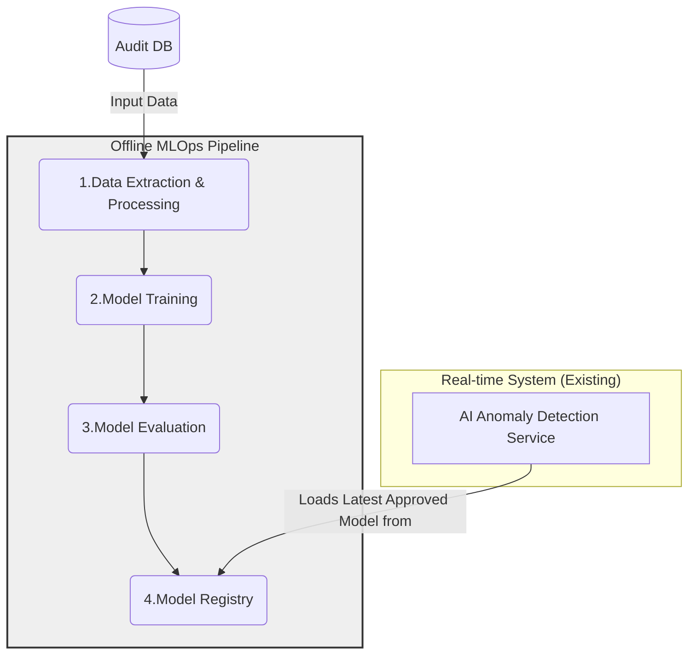
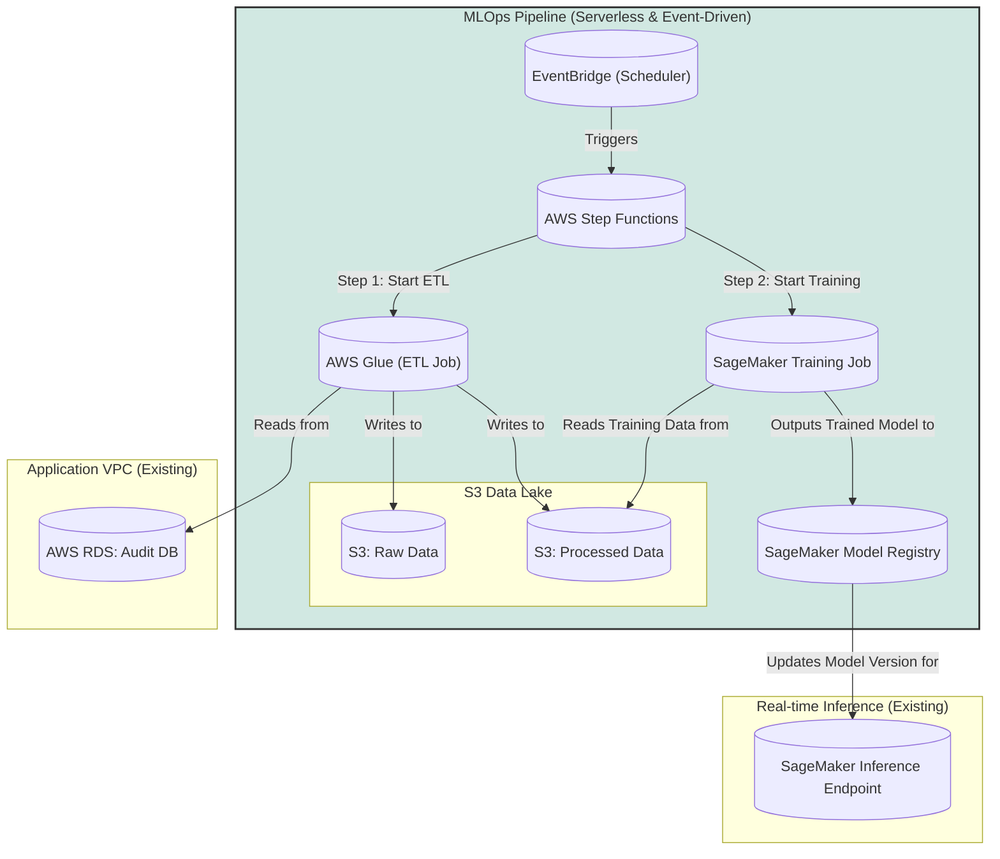

#### AI Model Training & Governance Pipeline

*   **Problem:** The AI model is static. Over time, as user behavior patterns change, the model's predictions will become less accurate (a phenomenon known as "model drift"). There is no automated process to retrain the model with fresh data, making the "AI" part of the system brittle.
*   **Solution:** Design an offline, automated MLOps (Machine Learning Operations) pipeline. This pipeline will be triggered on a schedule (e.g., weekly). It will extract recent, relevant data from the `Audit DB`, process it into a usable format, use this data to retrain the machine learning model, evaluate the new model's performance against a baseline, and if the new model is better, register it for deployment.
*   **Trade-offs:** This introduces a completely new and complex subsystem dedicated to MLOps. It requires specialized skills to build and maintain and adds significant costs for data storage (S3), data processing (Glue), and model training (SageMaker). However, this is the only way to ensure the long-term viability and accuracy of the AI-powered features.

#### 1. Logical View (C4 Component Diagram)

This view shows the new, offline MLOps pipeline as a distinct system that interacts with the `Audit DB` and produces a `Trained ML Model`, which is then consumed by our existing real-time services.

#### 2. Physical View (AWS Deployment Diagram)

This view maps the logical MLOps components to a serverless AWS architecture. This pipeline exists outside our main application VPC and interacts with it only to read from the audit database.

#### 3. Component-to-Resource Mapping Table

| Logical Component | Physical Resource | Rationale for Choice |
| :--- | :--- | :--- |
| **Pipeline Orchestrator** | **AWS Step Functions** | **Serverless Workflow Management:** Step Functions is a serverless orchestrator that excels at managing multi-step workflows with built-in error handling, retries, and state management. It's perfect for coordinating the sequence of ETL, training, and evaluation. |
| **Data Extractor** | **AWS Glue** | **Serverless ETL:** Glue is a fully managed ETL (Extract, Transform, Load) service that can run Spark jobs without requiring us to manage any servers. It's ideal for extracting data from our RDS database and transforming it into a format suitable for model training (e.g., Parquet) in S3. |
| **Model Trainer / Evaluator** | **Amazon SageMaker Training Jobs**| **Purpose-Built for ML:** SageMaker provides a fully managed environment for training and evaluating ML models at any scale. It handles provisioning the necessary compute, provides common ML frameworks, and manages the entire training lifecycle. |
| *(New Resource)* | **S3 Data Lake** | **Scalable & Cost-Effective Storage:** Amazon S3 is the ideal place to store the raw and processed data for model training. It's highly durable, scalable, and cost-effective. |
| **Model Registry** | **Amazon SageMaker Model Registry**| **Model Versioning & Governance:** The SageMaker Model Registry is a central, secure repository to catalog, version, and manage trained models. It tracks model metadata and approval status, which is critical for governance and for deploying the correct model to production. |
