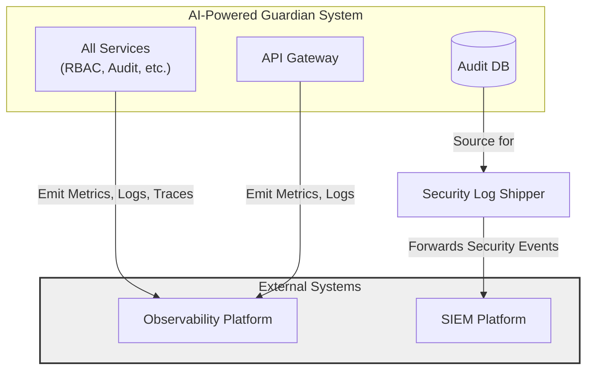
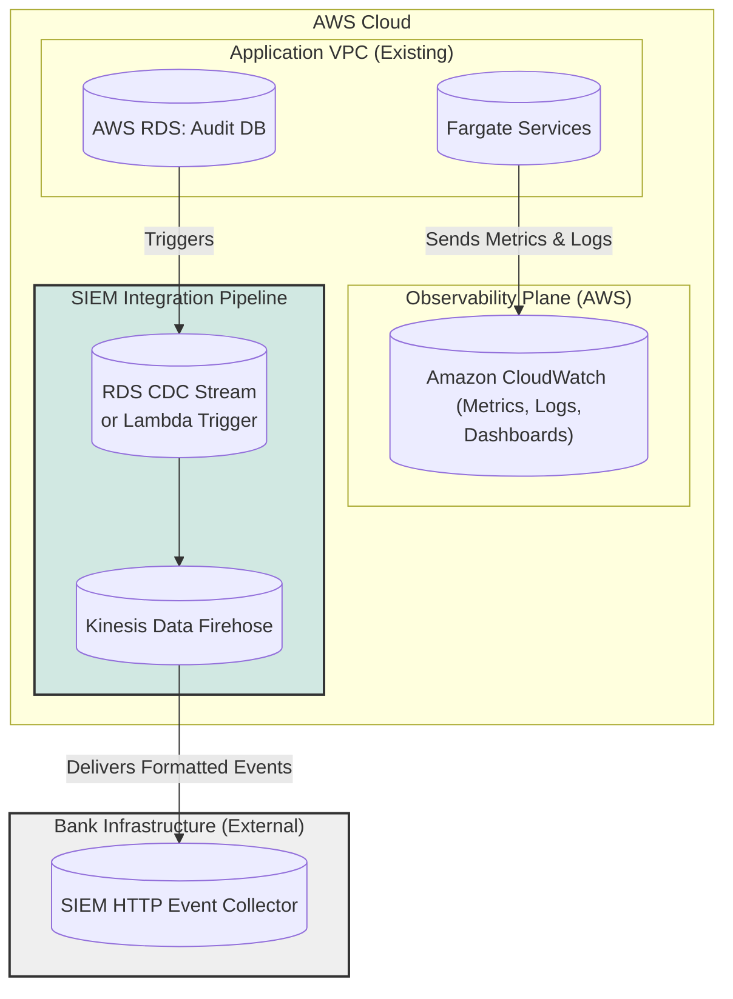

#### SIEM & Monitoring Integration

*   **Problem:** The system is a "black box." Operations teams cannot monitor the health and performance of its components, and the security team cannot receive the critical audit logs in their centralized SIEM platform for threat analysis.
*   **Solution:** Implement a comprehensive observability strategy.
    1.  **Metrics, Logs, and Traces:** All services will be instrumented to send performance metrics, application logs, and distributed traces to a centralized observability platform.
    2.  **SIEM Integration:** A durable, managed pipeline will be created to stream security events from our `Audit DB` to the bank's SIEM in a standardized format (e.g., CEF).
*   **Trade-offs:** This introduces additional costs for data ingestion and storage in the observability platform. Instrumenting code requires developer effort. However, this is a non-negotiable requirement for a production system to ensure it is supportable, secure, and auditable.

#### 1. Logical View (C4 Component Diagram)

This view shows our system now interacting with two new external systems: the bank's `Observability Platform` and `SIEM Platform`.

#### 2. Physical View (AWS Deployment Diagram)

This view maps the logical concepts to specific, managed AWS services, creating a robust and serverless pipeline for both monitoring and security event forwarding.

#### 3. Component-to-Resource Mapping Table

| Logical Component | Physical Resource | Rationale for Choice |
| :--- | :--- | :--- |
| **Observability Platform** | **Amazon CloudWatch** | **Native AWS Integration:** CloudWatch is the native observability service in AWS. It seamlessly collects metrics, logs, and traces from services like Fargate, RDS, and API Gateway with minimal configuration, making it the most efficient choice. |
| **Security Log Shipper** | **RDS CDC Stream + Kinesis Data Firehose**| **Reliable & Serverless Streaming:** This combination creates a powerful, event-driven pipeline. A Change Data Capture (CDC) stream from RDS or a Lambda function triggered by database updates can capture new audit logs in real-time. **Kinesis Data Firehose** is a fully managed service designed specifically to reliably deliver streaming data to endpoints like a SIEM. It handles buffering, batching, transformation (e.g., to CEF format), and retries automatically. |
| **SIEM Platform** | **3rd Party SIEM** | This represents the bank's existing, external SIEM system (e.g., Splunk, QRadar, Sentinel). Our architecture is designed to integrate with it via a standard HTTP endpoint. |
