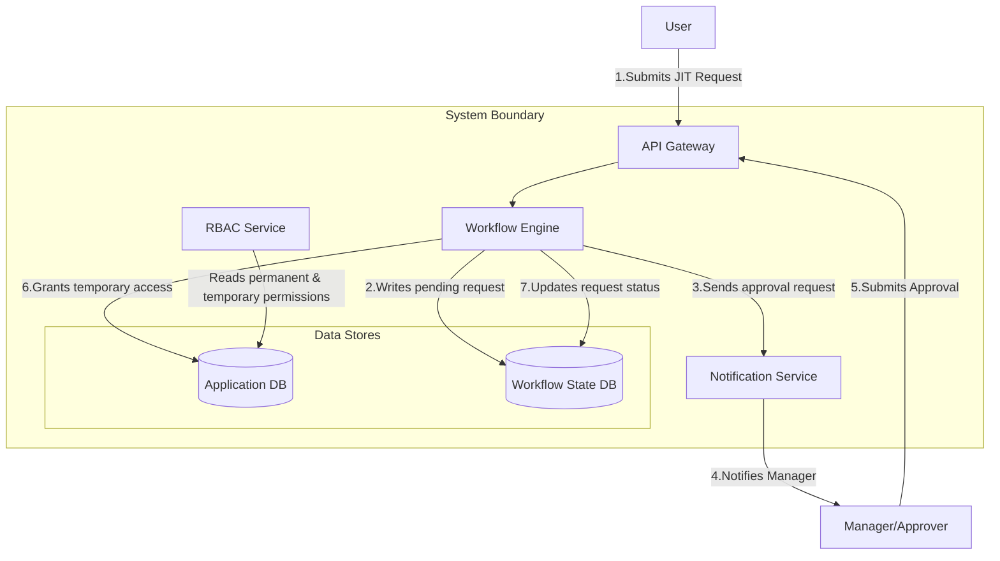
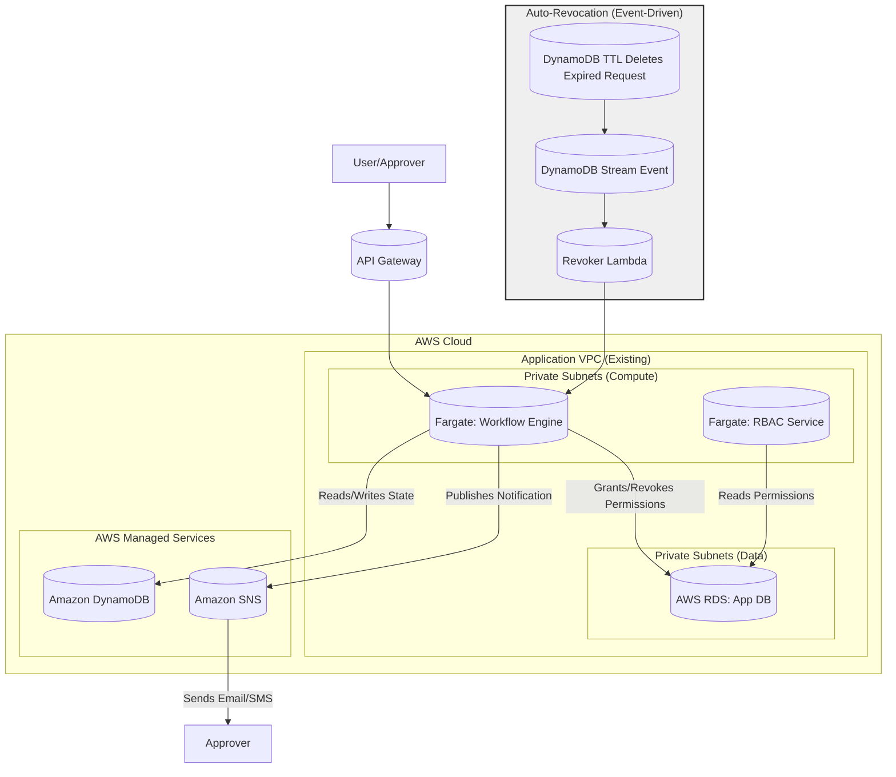

#### Just-in-Time (JIT) Access & Workflow Engine

*   **Problem:** Users sometimes require elevated permissions for short, specific tasks. Granting these permissions permanently violates the Principle of Least Privilege. A manual request-and-approval process via email or tickets is slow, inefficient, and difficult to audit.
*   **Solution:** Introduce a "Workflow Engine" service to manage the lifecycle of JIT access requests.
    1.  Users will request temporary access to roles or assets via the Web UI.
    2.  The Workflow Engine will orchestrate a configurable approval process (e.g., notifying the user's manager).
    3.  Upon approval, the engine will grant the permissions with a pre-defined expiration time.
    4.  The system will automatically revoke the permissions when the time expires.
*   **Trade-offs:** This introduces a new, stateful core service, adding significant logical complexity to the system. It requires a new database to track the state of workflows and a notification service for approvals. This increases cost and operational overhead but provides enormous security and efficiency benefits.

#### 1. Logical View (C4 Component Diagram)

This view introduces the new `Workflow Engine` and a `Notification Service`, showing how they orchestrate the JIT access lifecycle.

#### 2. Physical View (AWS Deployment Diagram)

This view adds a new Fargate service for the `Workflow Engine`. It uses Amazon DynamoDB for its state database due to its excellent scalability and serverless nature. Amazon SNS is used for notifications.

#### 3. Component-to-Resource Mapping Table

| Logical Component | Physical Resource | Rationale for Choice |
| :--- | :--- | :--- |
| **Workflow Engine** | **AWS Fargate Task** | **Serverless Compute:** Fargate remains the ideal choice for running our containerized application logic without managing servers. |
| **Workflow State DB** | **Amazon DynamoDB with TTL** | **Serverless & Scalable State:** DynamoDB is a fully managed NoSQL database that offers single-digit millisecond performance at any scale. It's perfect for storing the state of individual workflow requests. The **Time To Live (TTL)** feature is critical: we can set an expiration on each approved request, and DynamoDB will automatically delete the record, which can trigger our auto-revocation logic. |
| **Notification Service**| **Amazon SNS (Simple Notification Service)**| **Decoupled & Multi-Channel:** SNS is a managed pub/sub messaging service. It allows the Workflow Engine to simply publish a "needs approval" event without caring how the notification is sent. We can subscribe an email endpoint, an SMS endpoint, or even a Lambda function to the SNS topic, making it highly flexible. |
| *(New Process)* | **DynamoDB Streams + AWS Lambda** | **Event-Driven Revocation:** This is an elegant, serverless, and highly reliable pattern for handling expirations. When DynamoDB's TTL feature deletes an expired request record, it generates an event in a DynamoDB Stream. A Lambda function subscribed to this stream is automatically invoked, which then calls the Workflow Engine's API to perform the final permission revocation in the Application DB. |
