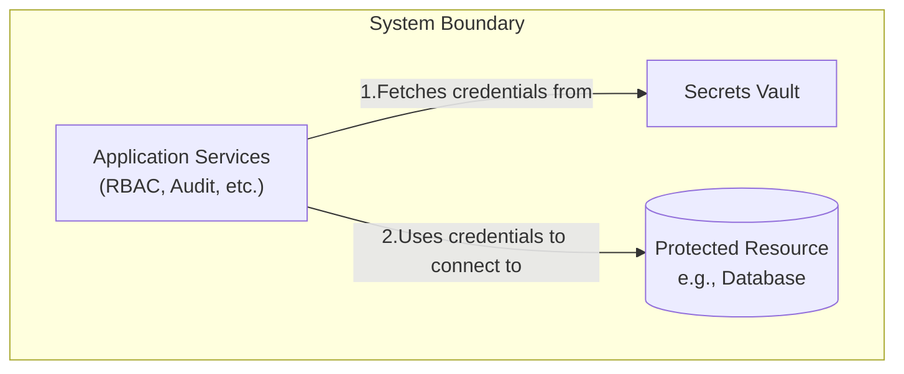
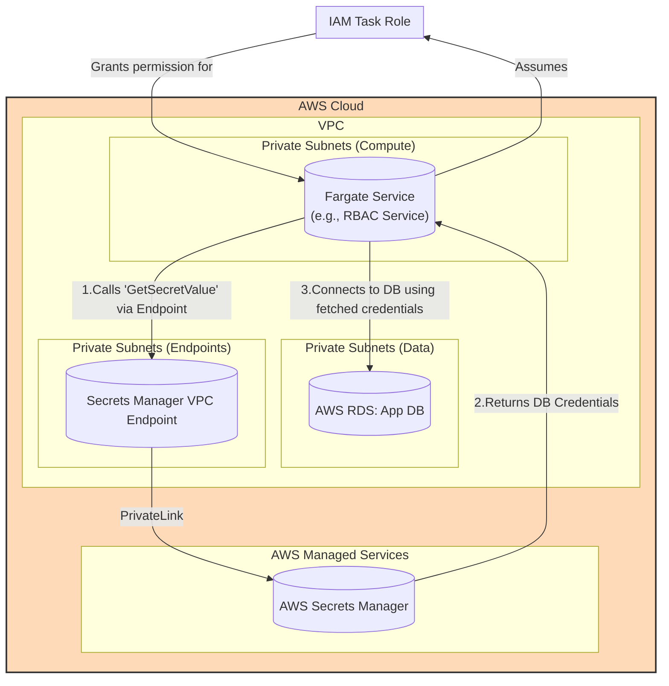
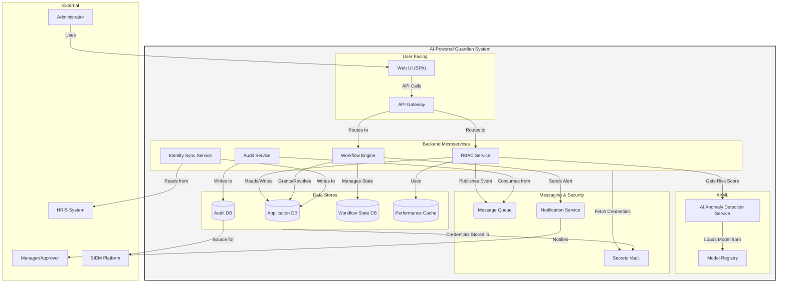
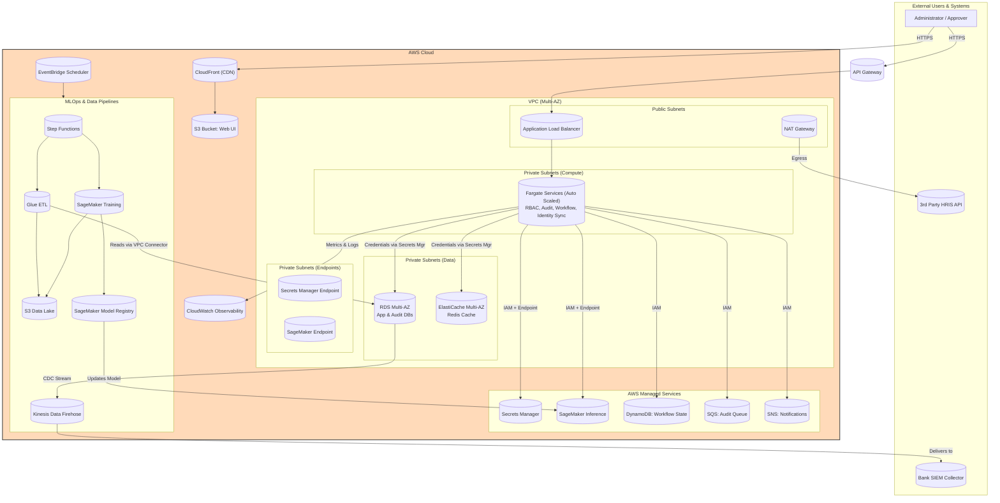

#### Secrets Management & Security Hardening

*   **Problem:** Secrets such as database credentials, API keys, and service-to-service tokens are often managed through environment variables or configuration files. This is a significant security risk, as these secrets can be accidentally logged, checked into version control, or exposed if a container is compromised.
*   **Solution:** Integrate a dedicated, centralized secrets management service. All application services (RBAC, Audit, etc.) will be modified to fetch their required secrets from this vault at runtime using their IAM role for authentication. This removes all secrets from the application's configuration and code.
*   **Trade-offs:** This introduces a new dependency on the secrets management service. The application's startup time will be slightly longer as it needs to make an initial call to fetch its secrets. This also requires more rigorous IAM policy management. However, the immense security benefit of centralizing and securing secrets is a non-negotiable best practice for any production system.

#### 1. Logical View (C4 Component Diagram)

This view shows that before accessing a protected resource, our services must first retrieve the necessary credentials from a central `Secrets Vault`.

#### 2. Physical View (AWS Deployment Diagram)

This view introduces **AWS Secrets Manager** and a **VPC Endpoint** for it. It shows how our Fargate services, using their assigned IAM roles, will call the Secrets Manager endpoint to retrieve database credentials before connecting to RDS.

#### 3. Component-to-Resource Mapping Table

| Logical Component | Physical Resource | Rationale for Choice |
| :--- | :--- | :--- |
| **Secrets Vault** | **AWS Secrets Manager** | **Secure, Managed, & Integrated:** AWS Secrets Manager is a dedicated service for securely storing and managing the lifecycle of secrets. Its key advantage is the deep integration with IAM for fine-grained permissions and with services like RDS for automatic credential rotation, which significantly enhances the security posture. |
| *(New Resource)*| **Secrets Manager VPC Endpoint**| **Enhanced Security:** To allow services in our private subnets to access Secrets Manager without their traffic traversing the public internet, a VPC Endpoint is used. This ensures that even the requests for secrets are kept on the private AWS network, providing an essential layer of security. |
| **Application Services**| **AWS Fargate Tasks (with IAM Task Roles)** | **Secure Identity:** The Fargate services are assigned specific IAM Task Roles. This gives each running container a secure identity that can be used to authenticate with other AWS services like Secrets Manager, following the principle of least privilege. |

#### 4. Overall Logical View (C4 Component Diagram)

#### 5. Overall Physical View (AWS Deployment Diagram)

