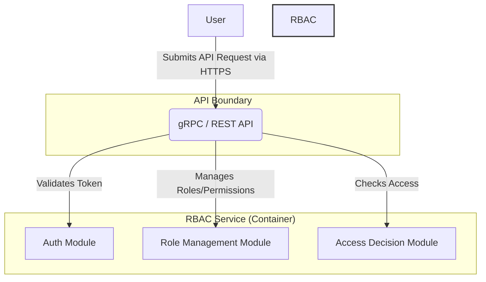
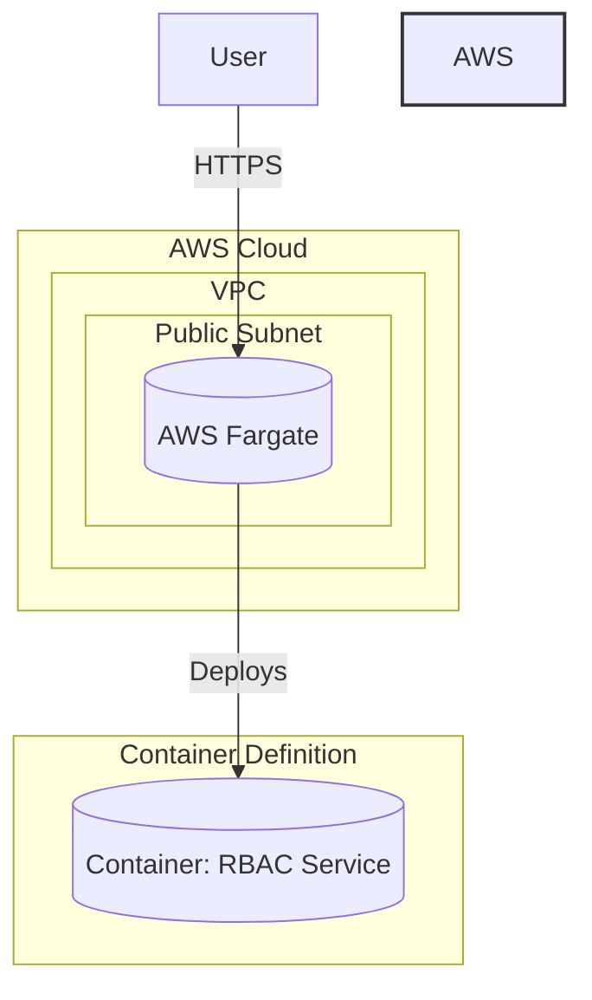

#### Core RBAC Service

*   **Problem:** The system needs a central component to handle the fundamental logic of role-based access control: authenticating users, managing roles, and making access decisions.
*   **Solution:** Design a single, containerized "RBAC Service" with three core modules: an Auth Module (handles token validation), a Role Management Module (manages role definitions and user assignments), and an Access Decision Module (evaluates access requests).
*   **Trade-offs:** This initial design is a monolith, which is simple to start but will have scalability and maintenance challenges later. It lacks data persistence, making it stateless and non-functional for real-world use, but this is acceptable for a foundational step.

#### 1. Logical View (C4 Component Diagram)

This diagram shows the internal components of the RBAC Service. It is a single, self-contained service with a clear API boundary and distinct internal modules for handling its core responsibilities.

#### 2. Physical View (AWS Deployment Diagram)

This diagram shows how the logical component will be physically deployed in AWS. For this initial step, we are using a simple, serverless container deployment model.

#### 3. Component-to-Resource Mapping Table

This table explicitly links the logical design to the physical implementation choices.

| Logical Component | Physical Resource | Rationale for Choice |
| :--- | :--- | :--- |
| **RBAC Service** | **AWS Fargate Task** | **Simplicity & Serverless:** Fargate is chosen as the container orchestrator because it's serverless. It removes the need to manage underlying EC2 instances, which is ideal for this initial stage. It allows us to focus on the application logic within the container without worrying about infrastructure management. It provides a simple, scalable, and cost-effective starting point. |
