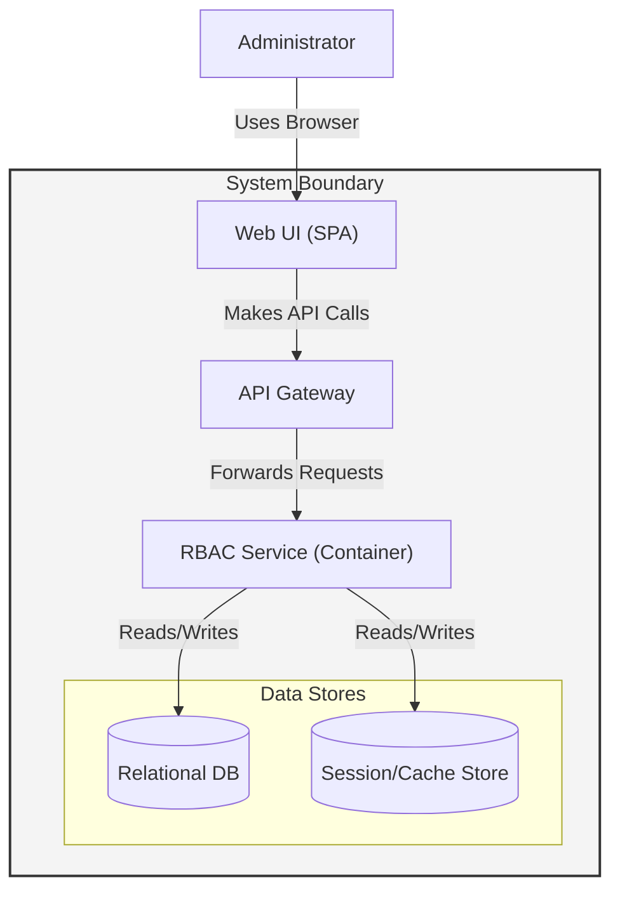
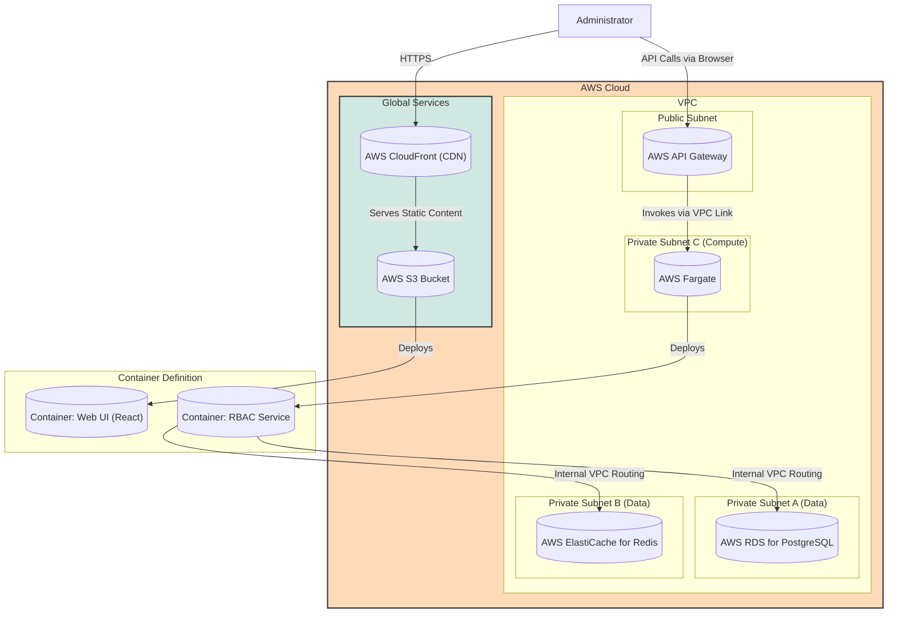

#### Web-facing UI & API Gateway

*   **Problem:** The system requires a secure, managed entry point for external API calls and a user interface for administrators. Direct exposure of the RBAC service is not secure or scalable.
*   **Solution:** Introduce an **API Gateway** to handle all incoming traffic, providing routing, rate limiting, and a single point of security enforcement. Add a containerized **Web UI** service (e.g., a React application) served via a **CloudFront CDN** for performance and low latency. The RBAC service will be moved to a private subnet, accessible only through the API Gateway.
*   **Trade-offs:** This adds several new components, increasing complexity. However, it is a non-negotiable step for a production system, providing massive benefits in security (by hiding backend services), scalability, and manageability. The CDN adds cost but is essential for a good global user experience.

#### 1. Logical View (C4 Component Diagram)

This view introduces the new `Web UI` component and shows how users now interact with the system indirectly through the `API Gateway`.

#### 2. Physical View (AWS Deployment Diagram)

This is a significant evolution. The `RBAC Service` is moved to a private subnet. The `API Gateway` becomes the public-facing entry point, and a new `CloudFront` + `S3` combination is added to serve the UI.

#### 3. Component-to-Resource Mapping Table

| Logical Component | Physical Resource | Rationale for Choice |
| :--- | :--- | :--- |
| **Web UI** | **AWS S3 + AWS CloudFront** | **Performance & Scalability:** S3 provides durable, cheap object storage for the static UI assets (HTML, CSS, JS). CloudFront is a global CDN that caches these assets at edge locations, providing low-latency access for users worldwide. |
| **API Gateway** | **AWS API Gateway (HTTP API)** | **Security & Management:** Provides a secure, managed entry point. It handles authentication, rate limiting, and request validation before traffic ever reaches our backend. The HTTP API type is cost-effective and suitable for our REST/gRPC needs. |
| **RBAC Service** | **AWS Fargate Task (in Private Subnet)** | **Security & Serverless:** Fargate remains ideal for its serverless nature. Moving it to a **private subnet** is a critical security enhancement. It is no longer directly accessible from the internet. |
| **Relational DB** | **AWS RDS for PostgreSQL** | **Managed & Reliable:** No change in rationale. |
| **Session/Cache Store** | **AWS ElastiCache for Redis** | **Managed & High-Performance:** No change in rationale. |
