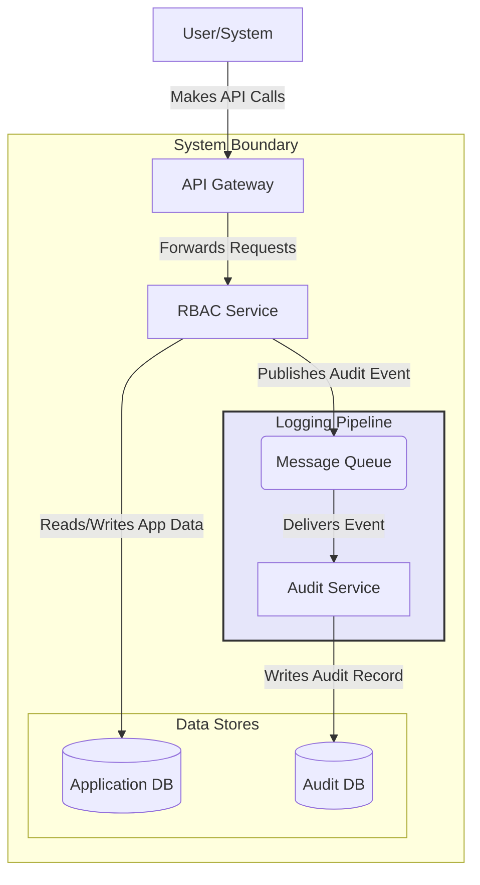
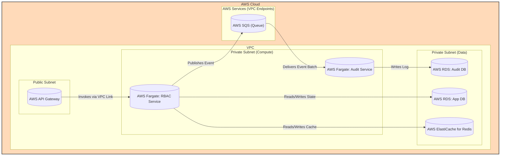

#### Asynchronous Logging & Auditing

*   **Problem:** Direct, synchronous logging from the RBAC Service to a database can introduce latency into critical, real-time access decisions. During a high-load event or a logging database failure, it could impact the entire system's performance and availability. Audit logs must be captured with high durability.
*   **Solution:** Decouple the logging process. The RBAC Service will publish audit events as messages to a durable Message Queue. A new, independent "Audit Service" will consume messages from this queue and write them to a dedicated audit database. This creates an asynchronous, resilient logging pipeline.
*   **Trade-offs:** This introduces "eventual consistency" for the audit trail—there will be a slight delay (from milliseconds to seconds) between an action occurring and it appearing in the audit log. The architecture becomes more complex with the addition of a message queue and a new service, increasing operational overhead. However, the gains in performance and reliability for the core RBAC service are a significant benefit.

#### 1. Logical View (C4 Component Diagram)

This view introduces the `Message Queue` and the new `Audit Service`, showing how it's now responsible for handling all audit data.

#### 2. Physical View (AWS Deployment Diagram)

This view adds AWS SQS as the message queue and a new Fargate service for our `Audit Service`, which writes to a dedicated PostgreSQL instance.

#### 3. Component-to-Resource Mapping Table

| Logical Component | Physical Resource | Rationale for Choice |
| :--- | :--- | :--- |
| **API Gateway** | **AWS API Gateway** | **Security & Management:** No change in rationale. |
| **RBAC Service** | **AWS Fargate Task** | **Security & Serverless:** No change in rationale. |
| **Message Queue** | **AWS SQS (Standard Queue)** | **Durability & Decoupling:** SQS is a fully managed, highly durable queue service. It guarantees "at-least-once" delivery, which is perfect for audit logs where losing an event is unacceptable. It effectively decouples the RBAC service from the logging process. |
| **Audit Service** | **AWS Fargate Task** | **Independent Scalability:** Running as a separate service allows its compute resources to be scaled independently of the core RBAC service, based on the volume of audit events. |
| **Application DB** | **AWS RDS for PostgreSQL** | **Managed & Relational:** This is the existing database, now explicitly named for its purpose. |
| **Audit DB** | **AWS RDS for PostgreSQL** | **Data Isolation & Security:** Using a separate database instance for audit logs ensures that high-volume logging activity does not impact the performance of the main application database. It also allows for stricter security and immutability controls on the audit data. |
