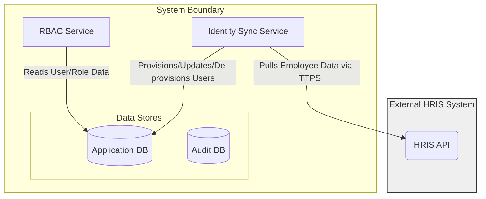
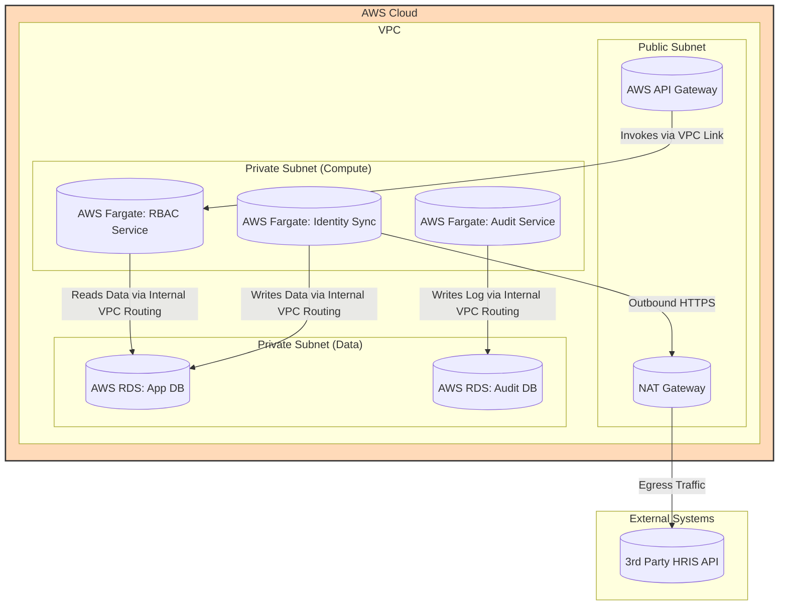

#### Integration with HRIS

*   **Problem:** User identity and role assignments are currently managed manually within the system. This is inefficient, prone to error, and creates a security risk when employees leave the bank or change roles (orphaned accounts). The system needs to be the "source of truth" for access, but not for identity.
*   **Solution:** Introduce a new "Identity Sync Service" that connects to the bank's external Human Resources Information System (HRIS). This service will run on a schedule (or respond to webhook events) to automatically provision, update, and de-provision user accounts in the Application DB based on data from the HRIS.
*   **Trade-offs:** This creates a dependency on an external system (the HRIS). The synchronization introduces a small delay between a change in the HRIS and the update in our system, which must be acceptable to the business. The new service adds to the operational complexity and cost of the system.

#### 1. Logical View (C4 Component Diagram)

This view introduces the new `Identity Sync Service` and shows its relationship with the external `HRIS` and the internal `Application DB`.

#### 2. Physical View (AWS Deployment Diagram)

This view adds a new Fargate service for the `Identity Sync Service` and shows its outbound-only internet connection required to access the external HRIS API. A NAT Gateway is introduced to facilitate this securely.

#### 3. Component-to-Resource Mapping Table

| Logical Component | Physical Resource | Rationale for Choice |
| :--- | :--- | :--- |
| **Identity Sync Service**| **AWS Fargate Task (Scheduled)** | **Serverless & Secure:** Fargate is ideal for a background task. It can be run on a schedule (e.g., every 15 minutes via EventBridge) or as a long-running service listening for webhooks. Placing it in the private subnet ensures it is not exposed to the internet. |
| *(New Resource)* | **NAT Gateway** | **Secure Egress:** To allow a service in a private subnet to initiate outbound connections to the internet (to reach the HRIS API) without having a public IP address itself, a NAT Gateway is required. This is a critical security control. |
| **RBAC Service** | **AWS Fargate Task** | No change in rationale. |
| **Audit Service** | **AWS Fargate Task** | No change in rationale. |
| **Application DB** | **AWS RDS for PostgreSQL** | No change in rationale. |
| **Audit DB** | **AWS RDS for PostgreSQL** | No change in rationale. |
