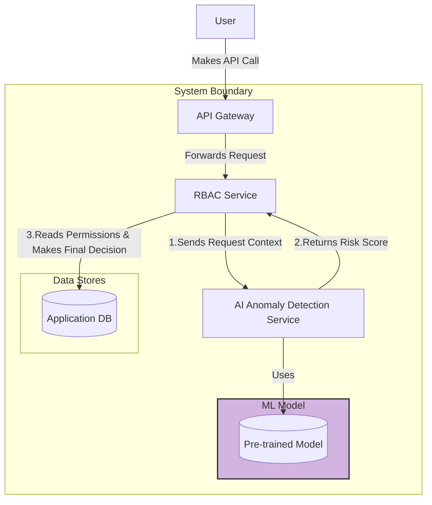
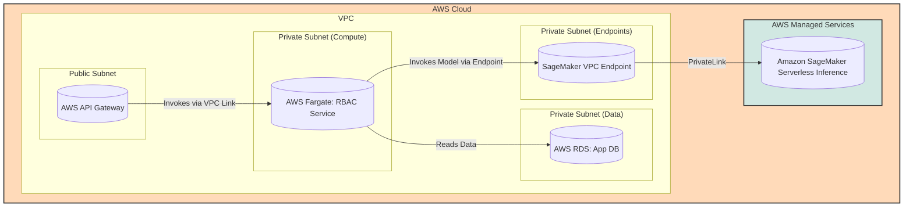

#### Introducing the AI Anomaly Detection Engine

*   **Problem:** The RBAC system is currently static. It can only enforce pre-defined rules but cannot identify unusual or risky behavior that falls within a user's legitimate permissions (e.g., a user suddenly accessing 100x more assets than usual).
*   **Solution:** Introduce a real-time "AI Anomaly Detection Service." When the RBAC Service processes an access request, it will synchronously send the request's context (user, asset, location, time) to this new AI service. The AI service will use a pre-trained machine learning model to calculate and return a risk score. The RBAC service will then use this score to make a more intelligent access decision (e.g., allow, deny, or flag for review).
*   **Trade-offs:** This adds a synchronous network call to the critical access decision path, which will increase latency. The performance and reliability of the AI service are now paramount to the system's overall performance. This also introduces the complexity of managing and deploying ML models, although the training pipeline itself will be addressed in a future issue.

#### 1. Logical View (C4 Component Diagram)

This view introduces the new `AI Anomaly Detection Service` and shows the real-time, synchronous interaction with the `RBAC Service`.

#### 2. Physical View (AWS Deployment Diagram)

This view introduces **Amazon SageMaker** for hosting our ML model. Communication between our Fargate-based RBAC service and the SageMaker endpoint will happen securely within the VPC using a **VPC Endpoint**.

#### 3. Component-to-Resource Mapping Table

| Logical Component | Physical Resource | Rationale for Choice |
| :--- | :--- | :--- |
| **RBAC Service** | **AWS Fargate Task** | No change in rationale. |
| **AI Anomaly Detection Service** | **Amazon SageMaker Serverless Inference**| **Optimized for ML & Serverless:** SageMaker is AWS's purpose-built service for machine learning. Serverless Inference is a cost-effective option that automatically provisions, scales, and manages the underlying compute for hosting the model, removing significant operational burden compared to a generic Fargate service. |
| *(New Resource)* | **SageMaker VPC Endpoint** | **Secure & Private Communication:** To allow the RBAC Service in our private subnet to communicate with the AWS-managed SageMaker service without sending traffic over the public internet, a VPC Endpoint is used. This creates a secure, private connection using AWS PrivateLink. |
| **Application DB** | **AWS RDS for PostgreSQL** | No change in rationale. |
